# Access Control Protocol Flows

This document outlines the access control management operations within the BTR protocol, focusing on role administration, timelock mechanisms, and permission management performed through the AccessControlFacet.

## Overview

The BTR access control system provides comprehensive role-based permission management through:

- **Role Administration**: Granting, revoking, and managing protocol roles
- **Timelock Mechanisms**: Delayed role grants with acceptance periods
- **Permission Validation**: Runtime permission checking and enforcement
- **Emergency Controls**: Circuit breaker functions for security incidents

## Access Control Architecture

### Core Components

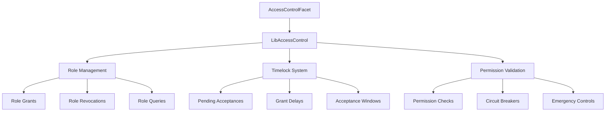

### Access Control Storage

```solidity
struct AccessControl {
    mapping(bytes32 => RoleData) roles;
    mapping(address => PendingAcceptance) pendingAcceptances;
    uint256 grantDelay;
    uint256 acceptanceTtl;
}

struct RoleData {
    mapping(address => bool) members;
    bytes32 adminRole;
    address[] memberList;
}
```

## Access Control Initialization

### 1. System Bootstrap

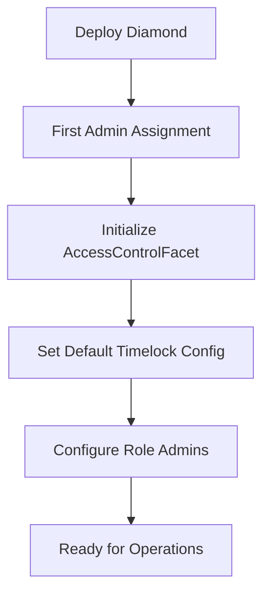

**Process**: Access control is initialized during diamond deployment with the first admin automatically assigned.

**Initial Configuration**:
- First admin receives immediate role grant (no timelock)
- Default timelock parameters are set
- Role admin hierarchy is established

## Role Management Operations

### 1. Role Grant Process

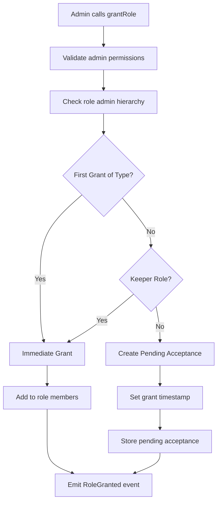

**Function**: `AccessControlFacet.grantRole()`

**Parameters**:
- `_role`: Role identifier to grant
- `_account`: Account to receive the role

**Access Control**: Only role admins can grant roles

**Timelock Exceptions**:
- First role grants (bootstrap scenario)
- KEEPER_ROLE grants (operational necessity)

### 2. Role Acceptance Process

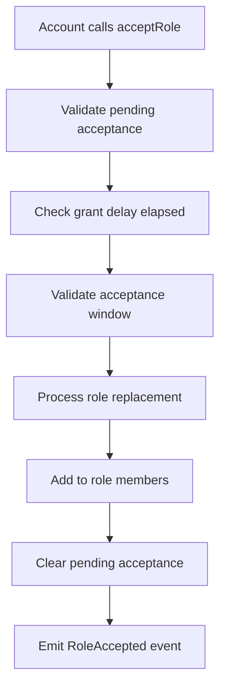

**Function**: `AccessControlFacet.acceptRole()`

**Parameters**: `_role` - Role to accept

**Validation Process**:
1. Confirm pending acceptance exists
2. Verify grant delay has elapsed
3. Check acceptance window hasn't expired
4. Handle role replacement if specified
5. Activate role membership

### 3. Role Revocation Process

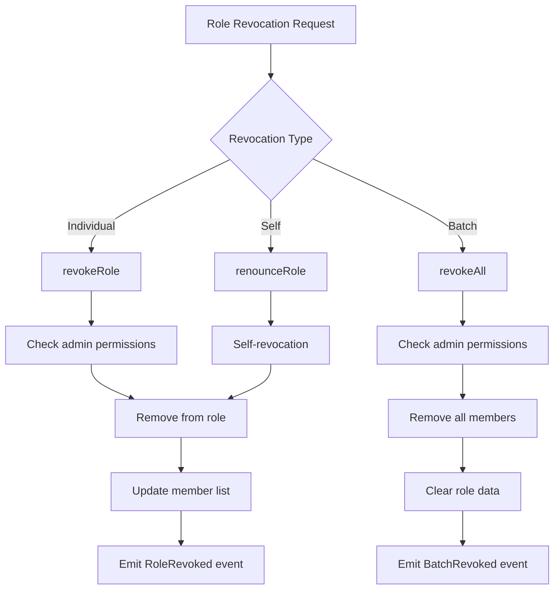

**Functions**:
- `AccessControlFacet.revokeRole(bytes32 _role, address _account)`
- `AccessControlFacet.renounceRole(bytes32 _role)`
- `AccessControlFacet.revokeAll(bytes32 _role)`

### 4. Pending Acceptance Management

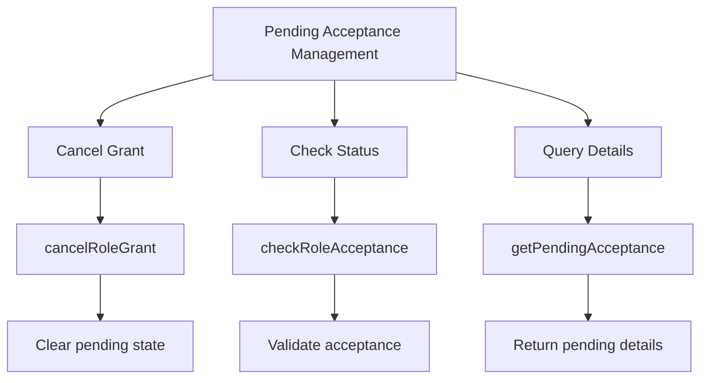

**Functions**:
- `AccessControlFacet.cancelRoleGrant(address _account)`
- `AccessControlFacet.checkRoleAcceptance(PendingAcceptance _acceptance, bytes32 _role)`
- `AccessControlFacet.getPendingAcceptance(address _account)`

## Timelock Configuration

### 1. Timelock Parameter Management

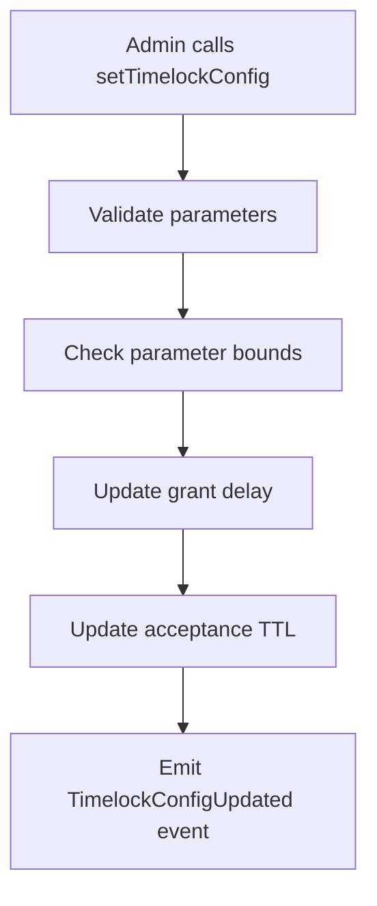

**Function**: `AccessControlFacet.setTimelockConfig()`

**Parameters**:
- `_grantDelay`: Delay before role can be accepted
- `_acceptanceTtl`: Window for accepting role after delay

**Validation Bounds**:
```solidity
uint256 public constant MIN_GRANT_DELAY = 1 days;
uint256 public constant MAX_GRANT_DELAY = 30 days;
uint256 public constant MIN_ACCEPT_WINDOW = 1 days;
uint256 public constant MAX_ACCEPT_WINDOW = 30 days;
```

### 2. Timelock Validation Flow

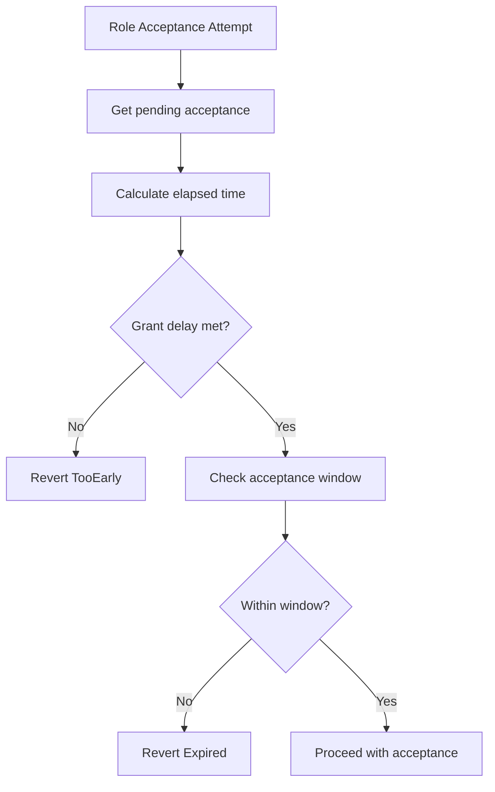

## Role Administration

### 1. Role Admin Configuration

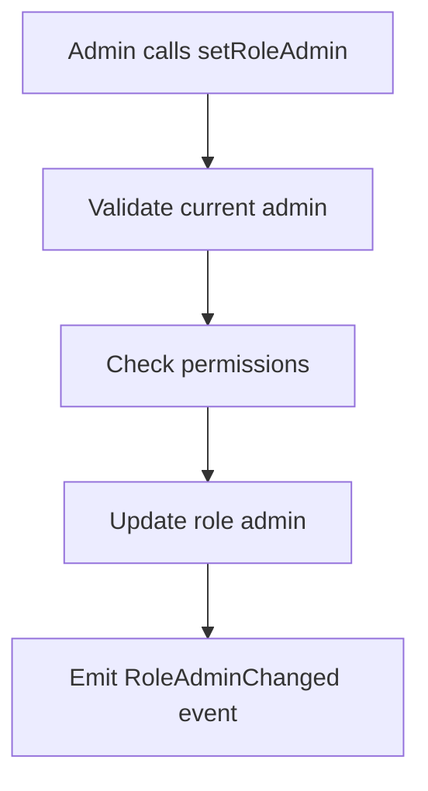

**Function**: `AccessControlFacet.setRoleAdmin()`

**Parameters**:
- `_role`: Role to update admin for
- `_adminRole`: New admin role

**Default Hierarchy**:
- ADMIN_ROLE is admin for all roles
- ADMIN_ROLE is self-administered

### 2. Role Membership Queries

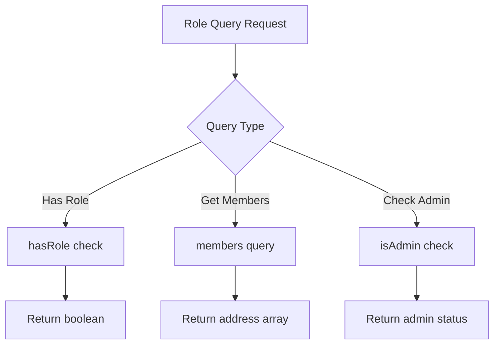

**Query Functions**:
- `hasRole(bytes32 _role, address _account)`: Check role membership
- `members(bytes32 _role)`: Get all role members
- Role-specific queries: `isAdmin()`, `isManager()`, `isKeeper()`, `isTreasury()`

## Emergency Controls

### 1. Circuit Breaker Operations

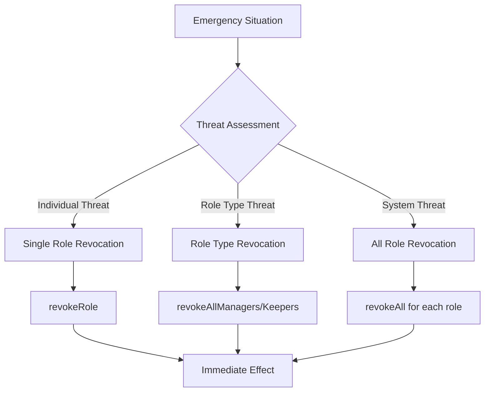

**Emergency Functions**:
- `AccessControlFacet.revokeRole()` - Individual revocation
- `AccessControlFacet.revokeAllManagers()` - All manager revocation
- `AccessControlFacet.revokeAllKeepers()` - All keeper revocation
- `AccessControlFacet.revokeAll()` - Complete role revocation

### 2. Emergency Response Flow

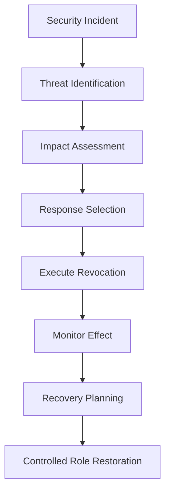

## Permission Validation

### 1. Runtime Permission Checks

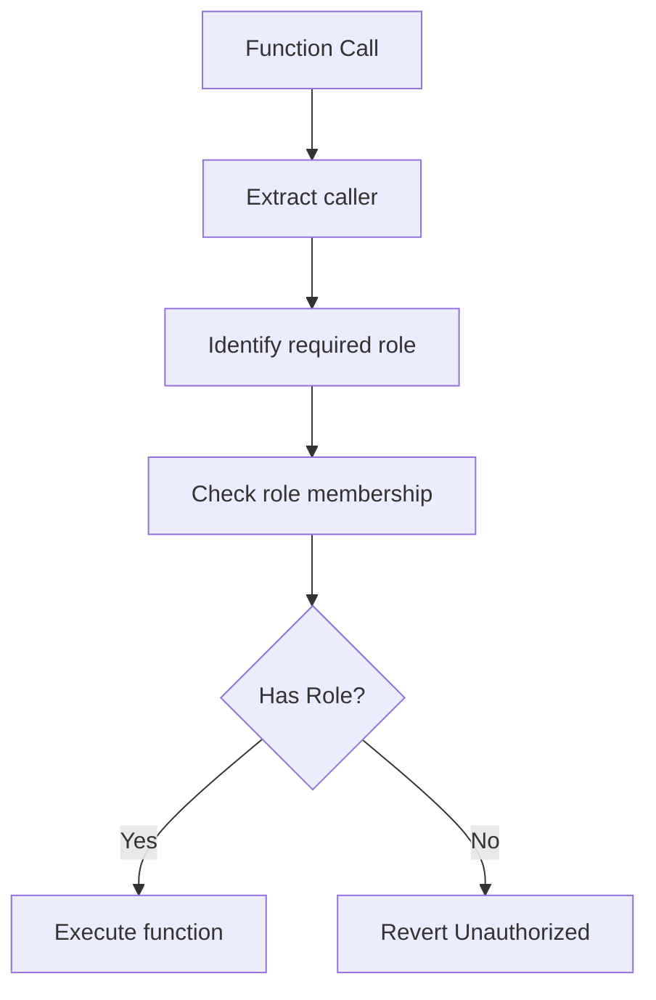

**Validation Pattern**:
```solidity
modifier onlyRole(bytes32 _role) {
    AC.checkRole(S.acc(), _role);
    _;
}
```

### 2. Role Hierarchy Validation

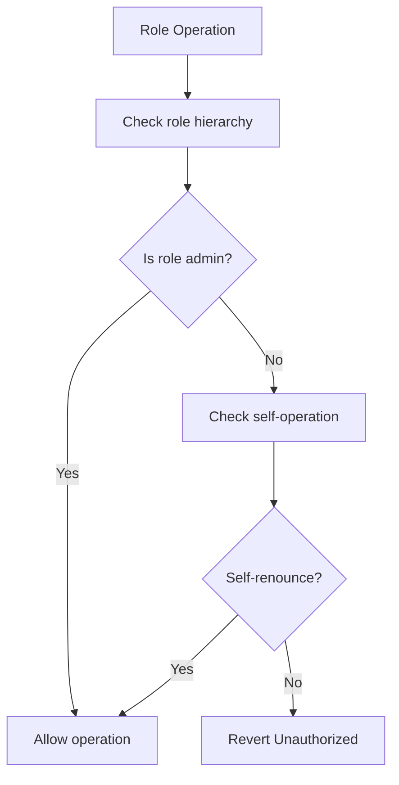

## ERC-173 Compliance

### 1. Ownership Interface

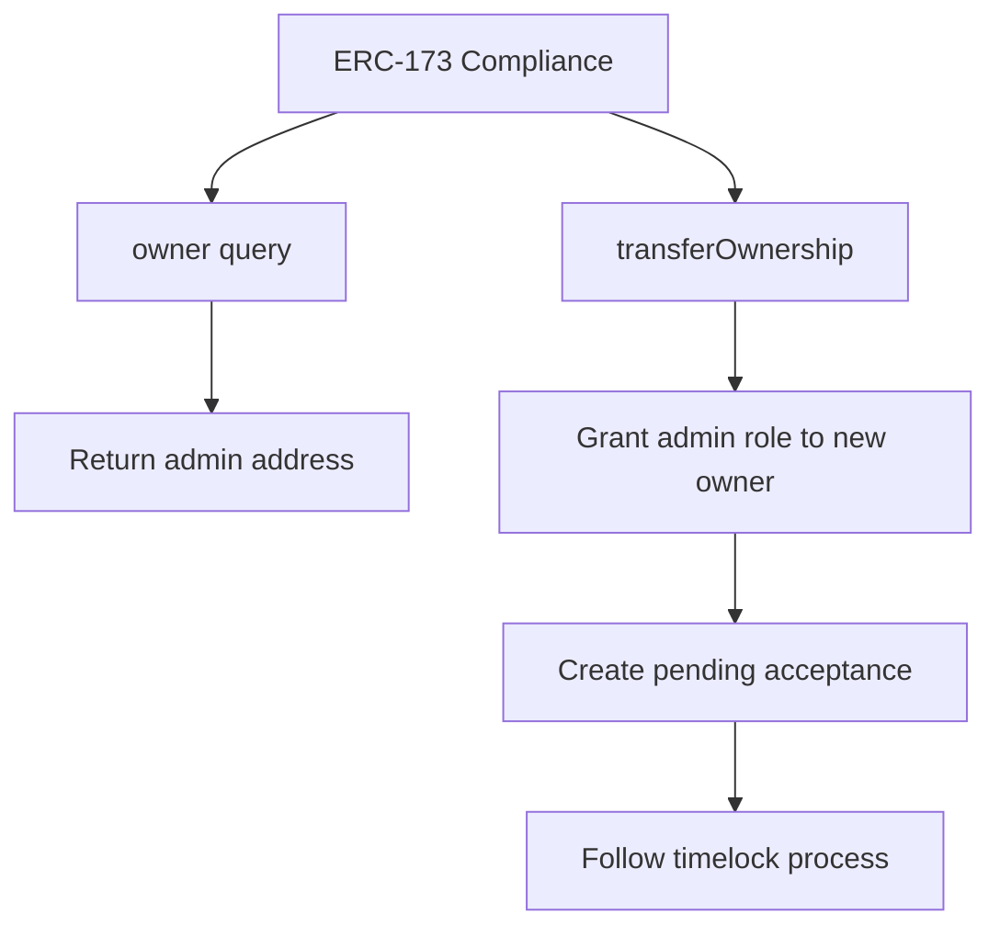

**Functions**:
- `AccessControlFacet.owner()` - Returns current admin address
- `AccessControlFacet.transferOwnership()` - Initiates admin role transfer

### 2. Ownership Transfer Flow

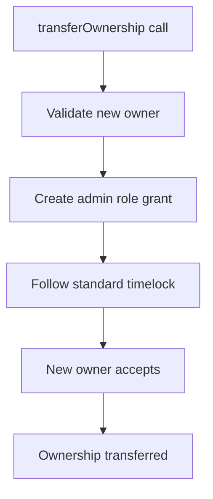

## Access Control Events

### 1. Role Management Events

```solidity
event RoleGranted(bytes32 indexed role, address indexed account, address indexed sender);
event RoleRevoked(bytes32 indexed role, address indexed account, address indexed sender);
event RoleAdminChanged(bytes32 indexed role, bytes32 indexed previousAdminRole, bytes32 indexed newAdminRole);
```

### 2. Timelock Events

```solidity
event RolePending(bytes32 indexed role, address indexed account, uint64 timestamp);
event RoleAccepted(bytes32 indexed role, address indexed account);
event RoleGrantCancelled(address indexed account);
```

## Integration Examples

### 1. Standard Role Grant

```solidity
// Grant manager role with timelock
accessControl.grantRole(MANAGER_ROLE, newManager);

// Manager accepts after delay
accessControl.acceptRole(MANAGER_ROLE);
```

### 2. Emergency Role Revocation

```solidity
// Individual threat
accessControl.revokeRole(MANAGER_ROLE, compromisedAccount);

// Team compromise
accessControl.revokeAllManagers();

// System compromise
accessControl.revokeAll(MANAGER_ROLE);
accessControl.revokeAll(KEEPER_ROLE);
```

### 3. Timelock Configuration

```solidity
// Set 2-day delay with 7-day acceptance window
accessControl.setTimelockConfig(2 days, 7 days);
```

## Error Handling

### Common Error Scenarios

1. **Unauthorized**: Caller lacks required role
2. **TooEarly**: Attempting acceptance before delay
3. **Expired**: Acceptance window has passed
4. **AlreadyInitialized**: Re-initialization attempt
5. **InvalidTimelock**: Timelock parameters out of bounds

### Recovery Procedures

1. **Role Loss**: Use admin role to re-grant lost roles
2. **Timelock Issues**: Adjust timelock configuration
3. **Emergency Recovery**: Use circuit breakers to restore control
4. **Bootstrap Recovery**: Re-deploy with new admin if necessary

## Monitoring and Metrics

### 1. Role Management Metrics

- **Active Roles**: Number of accounts per role
- **Pending Grants**: Number of unaccepted role grants
- **Grant Success Rate**: Percentage of grants that are accepted
- **Average Acceptance Time**: Time between grant and acceptance

### 2. Security Metrics

- **Revocation Events**: Frequency and patterns of role revocations
- **Emergency Actions**: Usage of circuit breaker functions
- **Failed Access Attempts**: Unauthorized access patterns
- **Role Churn**: Rate of role grants and revocations

This comprehensive access control protocol flow documentation ensures proper understanding and implementation of all role management operations within the BTR protocol.
