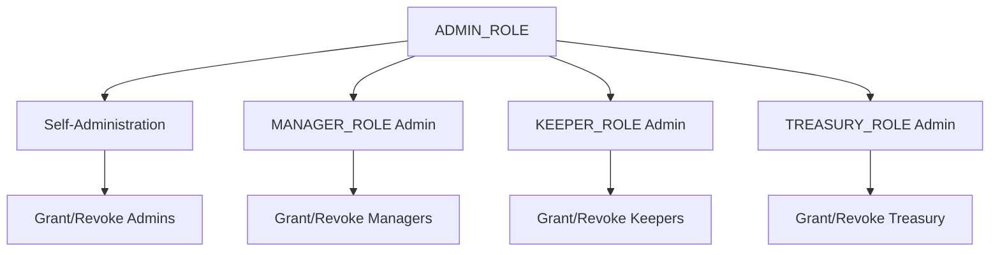
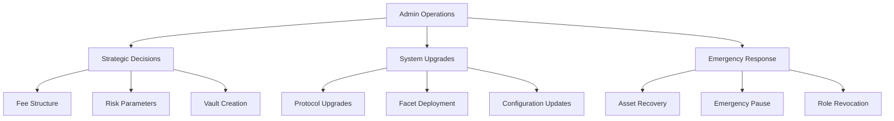
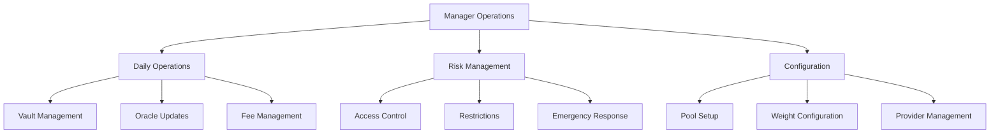
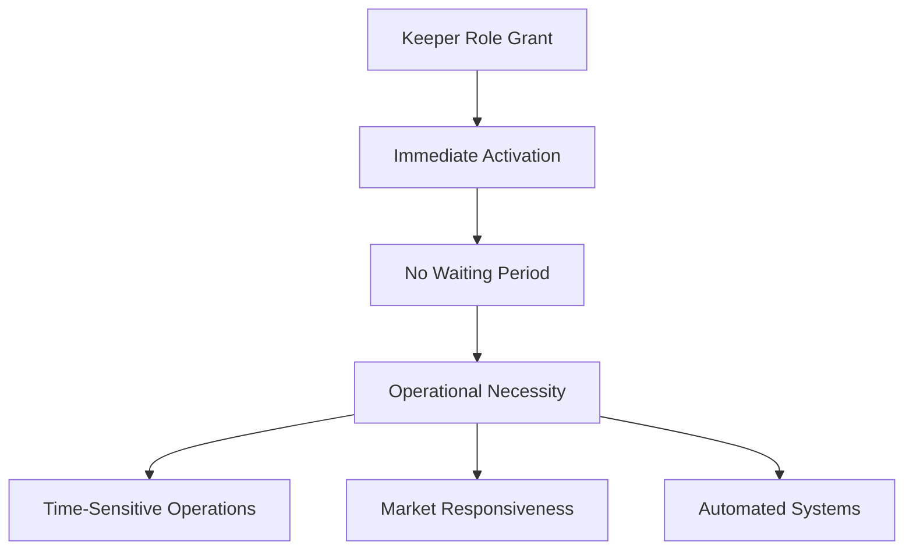
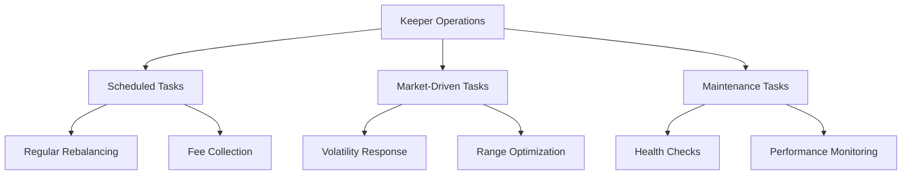
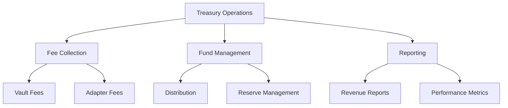
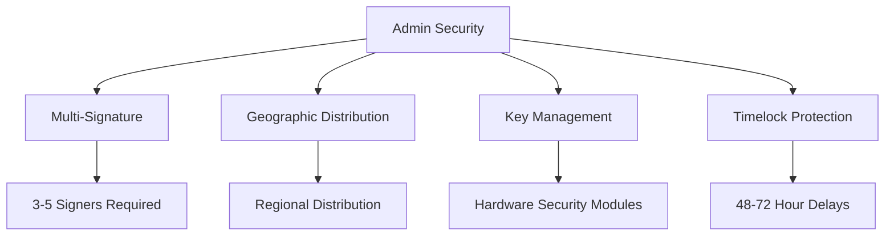
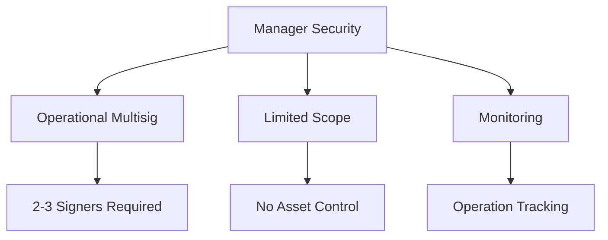
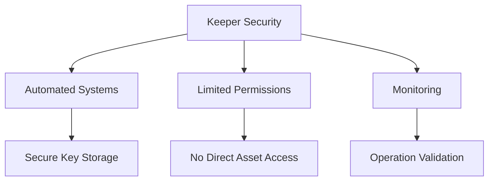
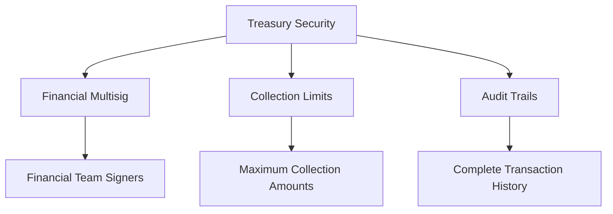

# Access Control Roles

This document defines the role hierarchy and responsibilities within the BTR protocol's access control system, focusing on role definitions, permissions, and operational boundaries for secure protocol governance.

## Overview

The BTR protocol implements a role-based access control (RBAC) system with four primary roles, each with specific permissions and responsibilities designed for secure multi-chain ALM operations.

## Role Hierarchy

### Role Definitions

```solidity
bytes32 public constant ADMIN_ROLE = keccak256("ADMIN_ROLE");
bytes32 public constant MANAGER_ROLE = keccak256("MANAGER_ROLE");
bytes32 public constant KEEPER_ROLE = keccak256("KEEPER_ROLE");
bytes32 public constant TREASURY_ROLE = keccak256("TREASURY_ROLE");
```

### Role Administration Structure



## ADMIN_ROLE

### Primary Responsibilities

**Governance & Protocol Control**
- Ultimate authority over protocol configuration and upgrades
- System-wide parameter management and emergency controls
- Role administration and access control governance

### Core Permissions

#### Protocol Management
- **Vault Creation**: `createVault()` - Create new ALM vaults
- **Version Control**: `setVersion()` - Update protocol version
- **Diamond Upgrades**: `diamondCut()` - Upgrade protocol facets
- **Initialization**: Initialize all protocol facets and components

#### Financial Control
- **Default Fees**: `setDefaultFees()` - Set protocol-wide fee structure
- **Treasury Configuration**: `setCollector()` - Configure treasury collector
- **Risk Models**: Set risk, weight, and liquidity models

#### Emergency Powers
- **Asset Recovery**: `requestRescue*()` - Initiate asset recovery procedures
- **Circuit Breakers**: Activate emergency stops and restrictions
- **Role Revocation**: `revokeAll*()` - Emergency role revocation

#### Access Control Administration
- **Role Management**: Grant, revoke, and manage all roles
- **Timelock Configuration**: Set role grant delays and acceptance windows
- **Role Admin Assignment**: Set admin roles for other roles

### Operational Context



### Implementation Pattern

**Typically implemented as**: Multi-signature wallet with 3-5 signers
**Decision Process**: Requires majority consensus for critical operations
**Geographic Distribution**: Signers distributed across regions for security

## MANAGER_ROLE

### Primary Responsibilities

**Operational Management & Configuration**
- Day-to-day protocol operations and parameter management
- Vault configuration and operational controls
- Risk management and access restrictions

### Core Permissions

#### ALM Vault Management
- **Pool Configuration**: `setPoolInfo()`, `setDexAdapter()` - Configure DEX integrations
- **Weight Management**: `setWeights()`, `zeroOutWeights()` - Set liquidity range weights
- **Vault Controls**: `pauseAlmVault()`, `unpauseAlmVault()` - Individual vault controls
- **Mint Restrictions**: `restrictMint()` - Control vault access

#### Oracle Management
- **Provider Configuration**: `setProvider()`, `removeProvider()` - Manage oracle providers
- **Feed Management**: `setFeed()`, `removeFeed()` - Configure price feeds
- **Oracle Parameters**: Set TWAP lookback, deviation limits, alternatives

#### Access & Risk Management
- **Account Status**: `setAccountStatus()` - Manage user access permissions
- **List Management**: `addToWhitelist()`, `addToBlacklist()` - Control access lists
- **Restrictions**: Set swap, bridge, and operation restrictions
- **Custom Fees**: `setCustomFees()` - Configure user-specific fee structures

#### System Controls
- **Pause Controls**: `pause()`, `unpause()` - System-wide pause functionality
- **Vault Fees**: `setAlmVaultFees()` - Configure vault-specific fees
- **Asset Recovery**: `rescue*()` - Execute approved recovery operations

### Operational Context



### Implementation Pattern

**Typically implemented as**: Multi-signature wallet with 2-3 operational signers
**Decision Process**: Requires operational consensus for parameter changes
**Response Time**: 1-24 hours for operational decisions

## KEEPER_ROLE

### Primary Responsibilities

**Automated Operations & Maintenance**
- Execute time-sensitive protocol operations
- Automated liquidity management and rebalancing
- System maintenance and optimization tasks

### Core Permissions

#### Rebalancing Operations
- **Full Rebalance**: `rebalance()` - Complete vault rebalancing with swaps
- **Range Management**: `burnRanges()`, `mintRanges()` - Granular range operations
- **Reminting**: `remintRanges()` - Re-deploy liquidity to existing ranges

#### Operational Queries
- **Rebalance Preparation**: `prepareRebalance()` - Simulate rebalancing operations
- **Range Previews**: `previewBurnRanges()` - Preview range burning outcomes

### Special Characteristics

#### No Timelock Requirement


**Rationale**: Keepers need immediate access for time-sensitive operations like rebalancing during market volatility.

#### Operational Context



### Implementation Pattern

**Typically implemented as**: 
- Automated bot systems with secure key management
- Backup keeper systems for redundancy
- Monitoring and alerting infrastructure

**Operational Model**:
- Primary: Automated execution based on predefined triggers
- Secondary: Manual intervention for complex scenarios
- Tertiary: Emergency keeper activation during system stress

## TREASURY_ROLE

### Primary Responsibilities

**Fee Collection & Treasury Management**
- Collect and manage protocol-generated fees
- Treasury fund administration and distribution
- Financial reporting and revenue management

### Core Permissions

#### Fee Collection
- **ALM Fee Collection**: `collectAlmFees()` - Collect vault-generated fees
- **Range Fee Collection**: `collectRangeFees()` - Collect DEX adapter fees

### Operational Context



### Implementation Pattern

**Typically implemented as**: 
- Multi-signature treasury wallet
- Automated collection systems
- Financial reporting infrastructure

**Collection Schedule**:
- Regular: Automated collection at defined intervals
- Threshold: Collection when fees reach specific amounts
- Manual: On-demand collection for specific requirements

## Role Interaction Matrix

| Initiator | Target Role | Operation | Timelock | Notes |
|-----------|-------------|-----------|----------|-------|
| Admin | Admin | Grant/Revoke | Yes | Self-administration |
| Admin | Manager | Grant/Revoke | Yes | Operational control |
| Admin | Keeper | Grant/Revoke | No | Operational necessity |
| Admin | Treasury | Grant/Revoke | Yes | Financial control |
| Manager | Any | Query | No | Read-only operations |
| Keeper | Any | Query | No | Read-only operations |
| Treasury | Any | Query | No | Read-only operations |

## Role Security Considerations

### ADMIN_ROLE Security



### MANAGER_ROLE Security



### KEEPER_ROLE Security



### TREASURY_ROLE Security



## Emergency Role Management

### Circuit Breaker Functions

```mermaid
graph TD
    A[Emergency Situation] --> B[Role Assessment]
    B --> C{Threat Level}
    
    C -->|Individual| D[Revoke Specific Role]
    C -->|Team| E[Revoke Role Type]
    C -->|System| F[Revoke All Roles]
    
    D --> G[`revokeRole()`]
    E --> H[`revokeAllManagers()`]
    F --> I[`revokeAll()`]
```

### Emergency Procedures

1. **Compromised Individual**: Immediate role revocation for specific account
2. **Team Compromise**: Revoke entire role type (all managers/keepers)
3. **System Compromise**: Emergency revocation of all operational roles
4. **Recovery**: Controlled re-granting of roles after security assessment

## Role Evolution

### Planned Role Expansion

**Future Considerations**:
- **AUDITOR_ROLE**: Read-only access for audit and compliance
- **OPERATOR_ROLE**: Specialized operational functions
- **EMERGENCY_ROLE**: Dedicated emergency response capabilities

### Role Refinement

**Ongoing Optimization**:
- Permission scope refinement based on operational experience
- Security enhancement through additional validation layers
- Automation improvements for operational efficiency

## Best Practices

### Role Assignment

1. **Principle of Least Privilege**: Grant minimum necessary permissions
2. **Separation of Duties**: No single role has complete control
3. **Regular Review**: Periodic assessment of role assignments
4. **Geographic Distribution**: Distribute critical roles across regions

### Security Practices

1. **Multi-Signature Requirement**: All critical roles use multisig
2. **Hardware Security**: Use hardware security modules for key storage
3. **Regular Rotation**: Periodic rotation of operational keys
4. **Monitoring**: Comprehensive logging and monitoring of all role operations

This comprehensive role definition ensures secure and efficient governance of the BTR protocol while maintaining operational flexibility and emergency response capabilities.
