# ALM Protocol Flows

This document outlines the administrative and operational flows within the BTR Supply ALM protocol, focusing on vault management, rebalancing operations, and system maintenance performed by admins, managers, and keepers.

## Overview

The BTR protocol operates with three primary operational roles:

- **Admins**: Create vaults, manage protocol settings, handle emergencies
- **Managers**: Configure vault parameters, manage DEX adapters, set weights
- **Keepers**: Execute rebalancing, range management, fee collection

## Vault Creation and Setup

### 1. Vault Creation Flow

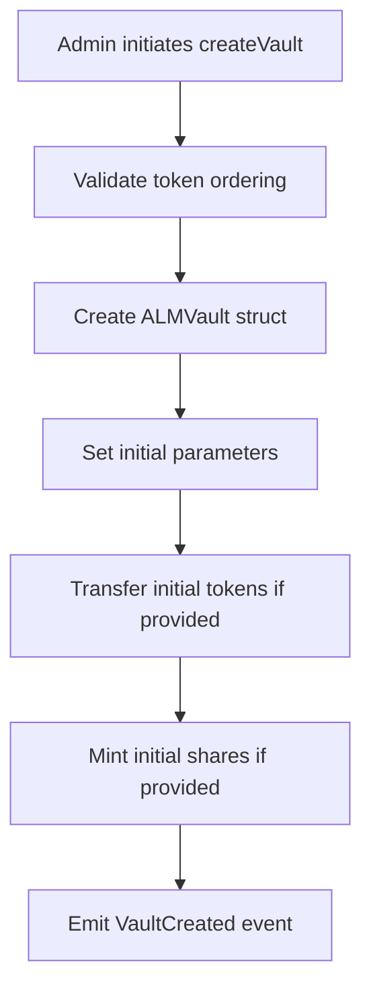

**Function**: `ALMProtectedFacet.createVault()`

**Parameters**:
```solidity
struct VaultInitParams {
    string name;
    string symbol;
    address token0;  // Must be < token1
    address token1;
    uint256 init0;   // Optional initial token0
    uint256 init1;   // Optional initial token1
    uint256 initShares; // Optional initial shares
}
```

**Validation**:
- Token ordering: `token0 < token1`
- Admin role verification
- Non-zero addresses

### 2. DEX Adapter Registration

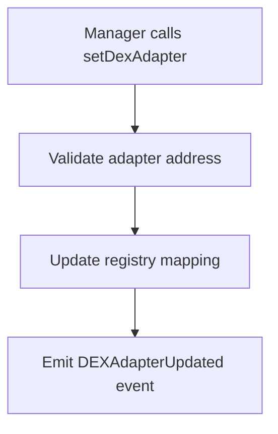

**Function**: `ALMProtectedFacet.setDexAdapter()`

Sets the adapter contract for a specific DEX type (UniV3, CakeV3, Thena).

### 3. Pool Registration

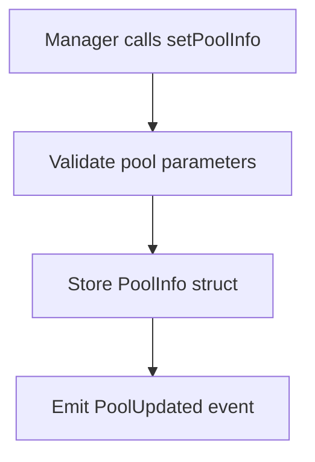

**Function**: `ALMProtectedFacet.setPoolInfo()`

**Pool Information**:
```solidity
struct PoolInfo {
    bytes32 id;
    address adapter;
    address pool;
    address token0;
    address token1;
    uint24 fee;
    int24 tickSpacing;
}
```

## Range Management Flows

### 1. Weight Setting

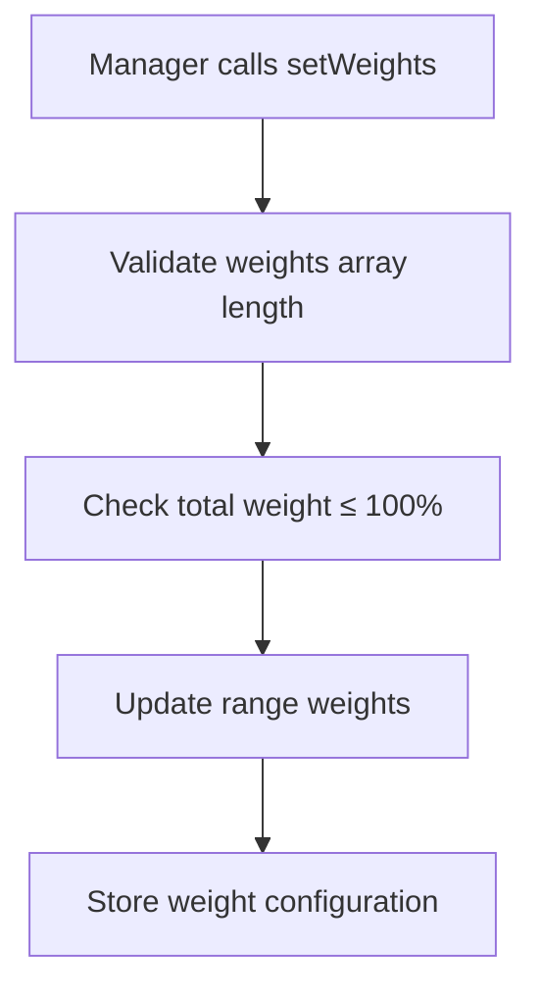

**Function**: `ALMProtectedFacet.setWeights()`

**Weight Rules**:
- Sum of weights must not exceed 10,000 BPS (100%)
- Each weight is stored as basis points (1 BPS = 0.01%)
- Zero weights are allowed (inactive ranges)

### 2. Range Creation Process

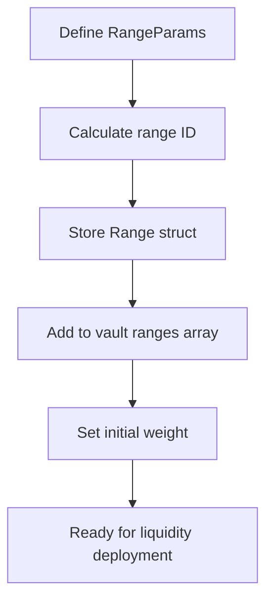

**Range Parameters**:
```solidity
struct RangeParams {
    bytes32 poolId;
    int24 tickLower;
    int24 tickUpper;
    uint8 weightBp;
}
```

## Rebalancing Operations

### 1. Full Rebalancing Flow

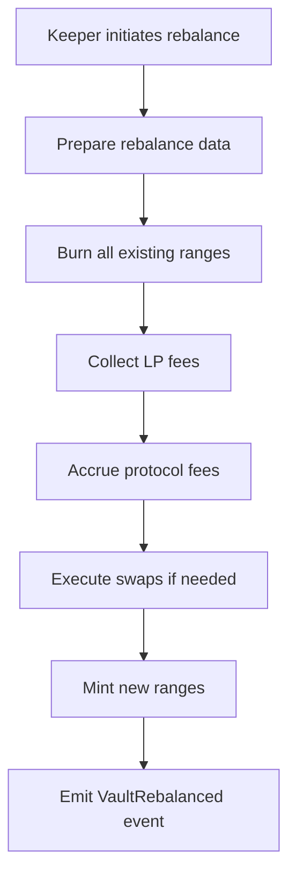

**Function**: `ALMProtectedFacet.rebalance()`

**Detailed Steps**:

1. **Range Burning**: All existing liquidity positions are burned
2. **Fee Collection**: LP fees are collected and protocol fees calculated
3. **Swap Execution**: Required token swaps to achieve target ratios
4. **Range Minting**: New liquidity positions created according to strategy

### 2. Incremental Range Management

#### Mint Ranges Only
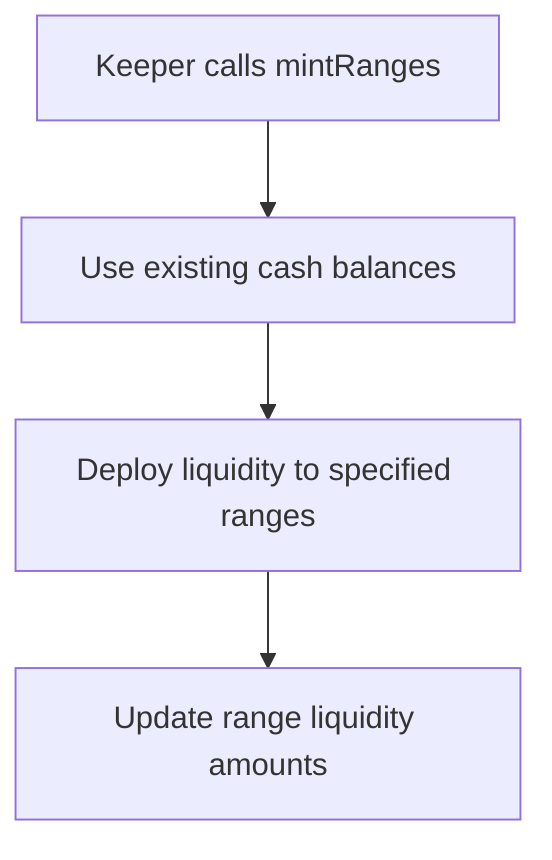

**Function**: `ALMProtectedFacet.mintRanges()`

#### Burn Ranges Only
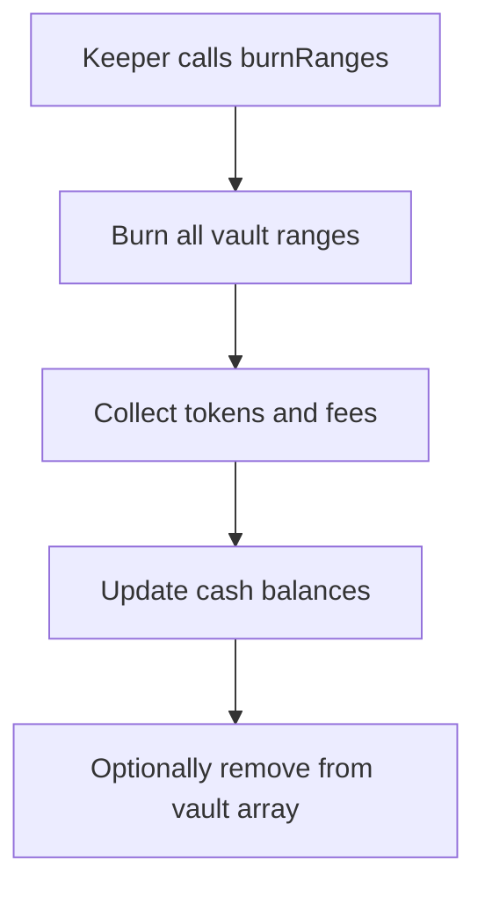

**Function**: `ALMProtectedFacet.burnRanges()`

#### Remint Existing Ranges
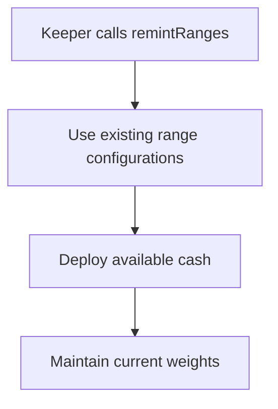

**Function**: `ALMProtectedFacet.remintRanges()`

## Fee Management Flows

### 1. Fee Accrual Process

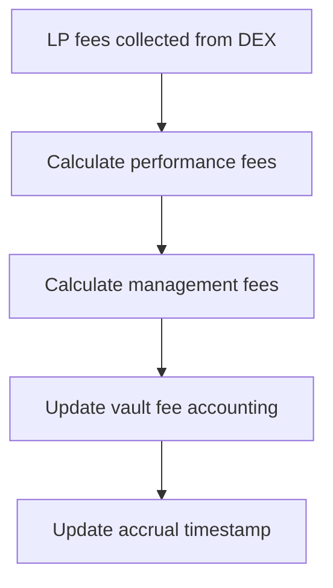

**Fee Types**:
- **Performance Fees**: Percentage of LP fee revenue
- **Management Fees**: Time-based fees on vault TVL
- **Entry/Exit Fees**: Applied to user operations

### 2. Fee Collection Flow

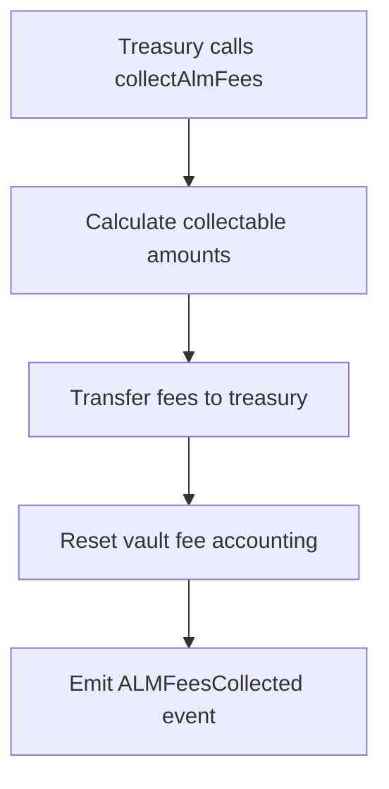

**Function**: `TreasuryFacet.collectAlmFees()`

**Access Control**: Only treasury role can collect fees

## Vault State Management

### 1. Pause/Unpause Operations

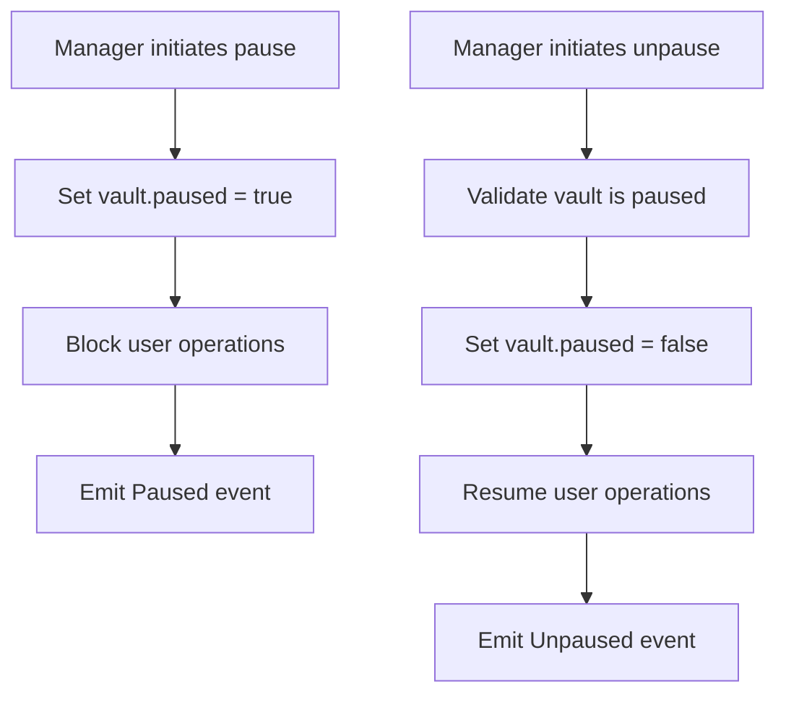

**Functions**:
- `ALMProtectedFacet.pauseAlmVault()`
- `ALMProtectedFacet.unpauseAlmVault()`

### 2. Mint Restriction Management

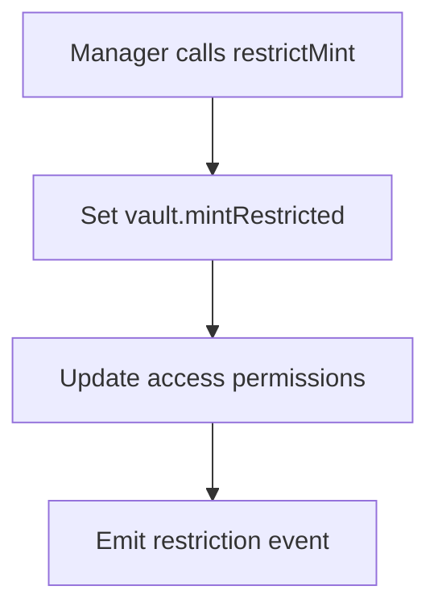

**Function**: `ALMProtectedFacet.restrictMint()`

**Effect**: When restricted, only unrestricted minters can deposit

## Operational Monitoring

### 1. Rebalance Preparation

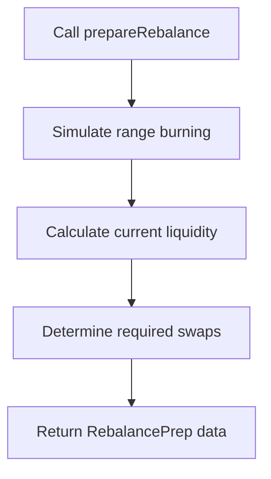

**Function**: `ALMProtectedFacet.prepareRebalance()`

**Returns**:
```solidity
struct RebalancePrep {
    uint256 vwap;           // Current VWAP
    uint256 totalLiq0;      // Total liquidity in token0 terms
    uint256 fee0;           // Protocol fees token0
    uint256 fee1;           // Protocol fees token1
    bool[] inverted;        // Range inversion flags
    int24[] lowerTicks;     // Lower tick bounds
    int24[] upperTicks;     // Upper tick bounds
    uint256[] lpNeeds;      // Liquidity needs per range
    uint256[] lpPrices0;    // LP prices in token0
}
```

### 2. Range Burn Preview

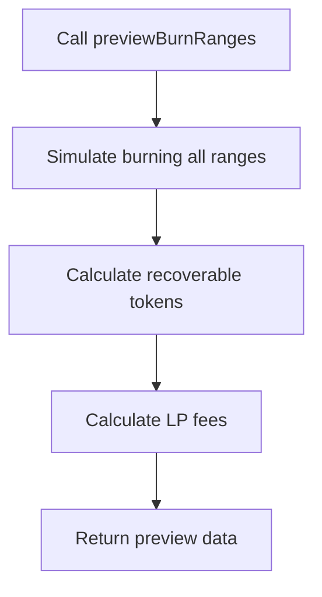

**Function**: `ALMProtectedFacet.previewBurnRanges()`

## Emergency Procedures

### 1. Protocol-Level Pause

```mermaid
graph TD
    A[Emergency detected] --> B[Admin calls pause]
    B --> C[Pause vault ID 0 (protocol)]
    C --> D[All operations halted]
    D --> E[Investigate and resolve]
    E --> F[Admin calls unpause]
    F --> G[Operations resume]
```

### 2. Asset Recovery

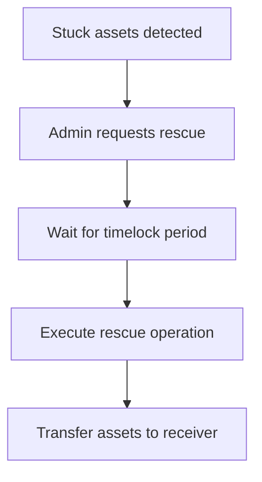

**Process**: Uses timelock mechanism for security

## Integration with External Systems

### 1. Keeper Network Integration

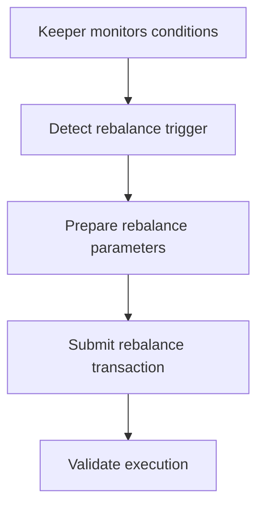

**Trigger Conditions**:
- Liquidity ratio thresholds
- Time-based rebalancing
- Market condition changes
- Manual triggers

### 2. Oracle Integration

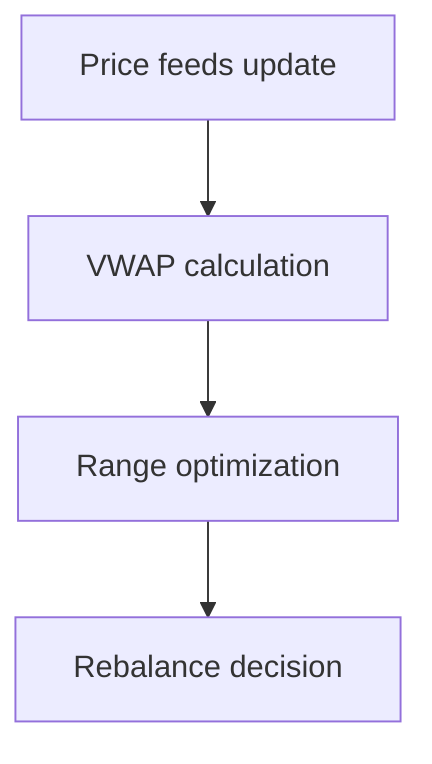

**Price Sources**:
- DEX pool prices
- External oracle feeds
- TWAP calculations

## Access Control Matrix

| Operation | Admin | Manager | Keeper | Treasury |
|-----------|-------|---------|--------|----------|
| Create Vault | ✓ | ✗ | ✗ | ✗ |
| Set DEX Adapter | ✗ | ✓ | ✗ | ✗ |
| Set Pool Info | ✗ | ✓ | ✗ | ✗ |
| Set Weights | ✗ | ✓ | ✗ | ✗ |
| Zero Weights | ✗ | ✓ | ✗ | ✗ |
| Pause Vault | ✗ | ✓ | ✗ | ✗ |
| Restrict Mint | ✗ | ✓ | ✗ | ✗ |
| Rebalance | ✗ | ✗ | ✓ | ✗ |
| Mint Ranges | ✗ | ✗ | ✓ | ✗ |
| Burn Ranges | ✗ | ✗ | ✓ | ✗ |
| Remint Ranges | ✗ | ✗ | ✓ | ✗ |
| Collect Fees | ✗ | ✗ | ✗ | ✓ |

## Performance Monitoring

### Key Metrics

1. **Rebalancing Frequency**: How often vaults rebalance
2. **Gas Efficiency**: Cost per operation
3. **Fee Generation**: Protocol revenue
4. **Liquidity Utilization**: Active vs. idle capital
5. **Slippage Impact**: Cost of rebalancing operations

### Operational Dashboards

- **Vault Performance**: TVL, APY, fee generation
- **Range Analytics**: Liquidity distribution, efficiency
- **Keeper Operations**: Rebalancing frequency, gas costs
- **Fee Analytics**: Revenue breakdown, collection rates

This comprehensive protocol flow documentation ensures proper understanding and execution of all administrative and operational aspects of the BTR Supply ALM system.
