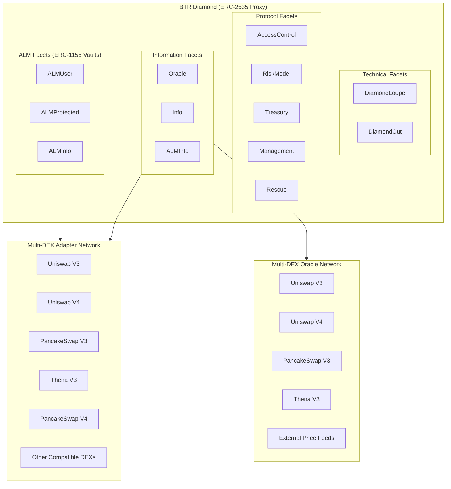
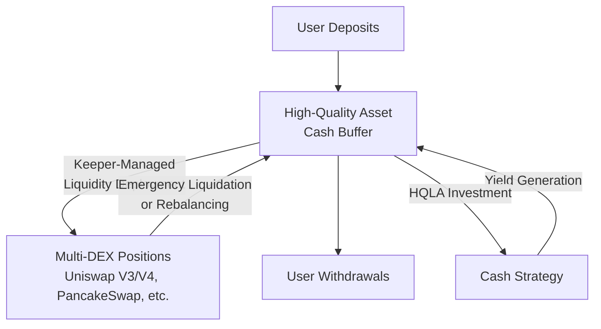
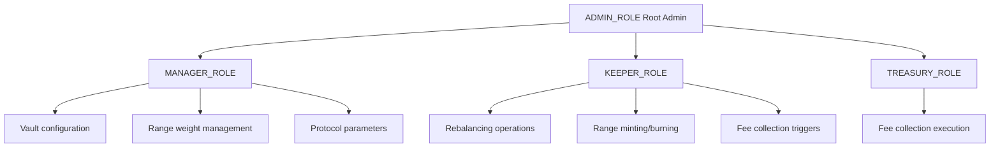

# BTR Supply Architecture

## Overview

BTR Supply is built using the **Diamond Standard (EIP-2535)** to create a modular, safely upgradeable, and gas-efficient protocol for **automated liquidity management across multiple DEXs**.

The first DeFi primitive deployed by BTR Supply is the **Automated Liquidity Manager (ALM)**, which optimizes TVL allocation across liquidity pools from multiple decentralized exchanges including Uniswap V3, Uniswap V4, PancakeSwap V3, Thena, and other compatible DEX protocols.

BTR's architecture enables the protocol to **manage liquidity positions across multiple DEXs** while maintaining a single unified interface for public use and permissioned DAO management.

## System Architecture



## Diamond Pattern Implementation

### Core Diamond Components

1. **BTRDiamond.sol**: The main proxy contract that delegates calls to appropriate facets
2. **DiamondCutFacet.sol**: Handles upgrades and facet management (EIP-2535 compliance)
3. **DiamondLoupeFacet.sol**: Provides introspection capabilities for the diamond

### Storage Architecture

The system uses the AppStorage pattern for organized storage:

```solidity
// BTRStorage.sol - Centralized storage layout
library BTRStorage {
    bytes32 constant DIAMOND_NS = keccak256("btr.diamond");
    bytes32 constant CORE_NS = keccak256("btr.core");
    bytes32 constant RESCUE_NS = keccak256("btr.rescue");
    
    function core() internal pure returns (CoreStorage storage);
    function diam() internal pure returns (Diamond storage);
    // ... other storage accessors
}
```

Key storage structures:
- **Registry**: Manages vaults, pools, and ranges
- **ALMVault**: Individual vault configuration and state
- **AccessControl**: Role-based permissions
- **Treasury**: Fee collection and management

## Core Facets

### ALMUserFacet
**Purpose**: User-facing operations for deposits and withdrawals

**Key Functions**:
- `deposit()`, `safeDeposit()`: Multi-token deposits
- `depositSingle0()`, `depositSingle1()`: Single-sided deposits
- `withdraw()`, `safeWithdraw()`: Multi-token withdrawals
- `withdrawSingle0()`, `withdrawSingle1()`: Single-sided withdrawals
- Preview functions for all operations

**Libraries Used**: `LibALMUser`, `LibALMBase`, `LibERC1155`

### ALMProtectedFacet
**Purpose**: Administrative and keeper operations

**Key Functions**:
- `createVault()`: Vault creation (admin only)
- `setWeights()`, `zeroOutWeights()`: Range weight management
- `rebalance()`: Full vault rebalancing (keeper only)
- `mintRanges()`, `burnRanges()`: Range management
- `pauseAlmVault()`, `unpauseAlmVault()`: Emergency controls

**Libraries Used**: `LibALMProtected`, `LibALMBase`

### ALMInfoFacet
**Purpose**: Read-only information and previews

**Key Functions**:
- Vault information queries
- Balance and ratio calculations
- Price and VWAP functions
- Preview calculations for user operations

**Libraries Used**: `LibALMBase`, `LibERC1155`

## DEX Integration Architecture

### Abstract Base Classes

```solidity
// DEXAdapterFacet.sol - Base for all DEX integrations
abstract contract DEXAdapterFacet {
    function setPoolInfo(bytes32 _pid, PoolInfo calldata _info) external;
    // Common DEX operations
}

// V3AdapterFacet.sol - Base for Uniswap V3-style DEXs
abstract contract V3AdapterFacet is DEXAdapterFacet {
    function mintRange(bytes32 _rid, uint128 _liquidity) external;
    function burnRange(bytes32 _rid, uint128 _liquidity) external;
    // V3-specific operations
}
```

### Specific Implementations

1. **UniV3AdapterFacet**: Uniswap V3 integration
2. **CakeV3AdapterFacet**: PancakeSwap V3 integration  
3. **ThenaV3AdapterFacet**: Thena DEX integration

Each adapter handles:
- Pool registration and validation
- Liquidity position management
- Fee collection
- Token ordering and safety checks

## Vault Management System

### ERC-1155 Implementation

Vaults are implemented as ERC-1155 tokens for gas efficiency:

```solidity
// Each vault ID maps to an ALMVault struct
mapping(uint32 => ALMVault) vaults;

// Users hold shares as ERC-1155 tokens
mapping(address => mapping(uint32 => uint256)) balances;
```

**Benefits**:
- Reduced deployment costs (no new contract per vault)
- Batch operations support
- Unified interface across all vaults

### Range Management

Each vault can have multiple liquidity ranges across different DEXs:

```solidity
struct ALMVault {
    uint32 id;
    string name;
    string symbol;
    IERC20 token0;
    IERC20 token1;
    bytes32[] ranges;  // Array of range IDs
    mapping(address => uint256) cash;  // Token balances
    // ... other fields
}

struct Range {
    bytes32 id;
    bytes32 poolId;
    int24 tickLower;
    int24 tickUpper;
    uint128 liquidity;
    uint8 weightBp;  // Weight in basis points
}
```

## Cash Buffer System: Optimization Architecture

### Purpose and Design Philosophy

The BTR cash buffer system is a fundamental architectural choice designed for **gas cost optimization** and **enhanced security**, not because of asset quality concerns. The vault tokens (typically high-grade assets like USDC, WETH) are excellent stores of value - cash reserves serve strategic optimization functions.

### Architecture



### Strategic Benefits

#### 1. **Gas Cost Optimization at Scale**
- **User Cost Reduction**: Individual operations cost $1-4 instead of $15-50 per DEX interaction
- **Batched Operations**: Thousands of user operations batched into single keeper transactions
- **Amortized Costs**: DEX interaction costs distributed across all vault participants
- **Layer 1 Efficiency**: 70%+ gas savings compared to direct DEX interaction

#### 2. **Enhanced Security & Liquidity Management**
- **Emergency Liquidity**: Immediate funds available during major liquidation events without slippage
- **Flow Buffering**: Handles net inflows/outflows without constant DEX rebalancing
- **MEV Protection**: Reduces predictable transaction patterns vulnerable to front-running
- **Operational Resilience**: Maintains functionality during DEX downtime or network congestion

#### 3. **Yield Generation on Reserves**
- **High-Quality Liquid Assets (HQLA)**: Cash invested only in top-tier, instantly redeemable positions
- **Capital Efficiency**: Eliminates traditional cash drag through strategic yield generation
- **Instant Accessibility**: Maintains immediate liquidity while earning returns
- **Risk Management**: Conservative investment only in safest DeFi protocols (AAVE, Compound)

### Liquidity Management

The system maintains optimal cash ratios using dynamic formulas based on vault scale:

```solidity
// Target liquidity decreases with vault size for efficiency
targetRatio = minRatio + (1 - minRatio) × (1 + TVL × tvlFactor)^(-tvlExponent)

// Example: $1M vault = 7.4% cash, $100M vault = 5.0% cash
```

**Economic Rationale**:
- **Scale Economies**: Larger vaults can operate with lower relative cash ratios
- **Flow Netting**: Bigger pools have better inflow/outflow offsetting
- **Operational Efficiency**: Optimal balance between accessibility and capital deployment

## Fee System Architecture

### Fee Types

1. **Entry Fees**: Applied on deposits
2. **Exit Fees**: Applied on withdrawals  
3. **Management Fees**: Time-based fees on AUM
4. **Performance Fees**: Percentage of profits
5. **Flash Fees**: For flash loan operations

### Ratio-Based Fee Adjustment

```solidity
// Fees adjust based on how operations affect vault ratios
int256 ratioDiff = calculateRatioImprovement(operation);
uint256 adjustedFee = baseFee + ratioAdjustment(ratioDiff);
```

This incentivizes balanced operations and penalizes ratio-worsening activities.

## Access Control System

### Role Hierarchy



### Permission Matrix

| Function | Admin | Manager | Keeper | User |
|----------|-------|---------|--------|------|
| Create Vault | ✓ | ✗ | ✗ | ✗ |
| Set Weights | ✗ | ✓ | ✗ | ✗ |
| Rebalance | ✗ | ✗ | ✓ | ✗ |
| Deposit | ✗ | ✗ | ✗ | ✓ |
| Withdraw | ✗ | ✗ | ✗ | ✓ |

## Security Architecture

### Reentrancy Protection

```solidity
modifier nonReentrant() {
    require(_status != _ENTERED, "ReentrancyGuard: reentrant call");
    _status = _ENTERED;
    _;
    _status = _NOT_ENTERED;
}
```

All state-changing functions use reentrancy guards.

### Pausability

- **Protocol-level pausing**: Emergency stop for all operations
- **Vault-level pausing**: Granular control per vault
- **Function-level checks**: Each operation validates pause state

### Input Validation

- **Token ordering**: Ensures token0 < token1 for all pairs
- **Range validation**: Tick bounds and liquidity checks
- **Slippage protection**: Minimum/maximum bounds on all operations

## Gas Optimization Strategies

### Batch Operations

```solidity
// Multiple ranges can be managed in single transaction
function rebalance(RebalanceParams memory _params) external {
    // Burn all existing ranges
    // Execute required swaps
    // Mint new ranges
}
```

### Storage Optimization

- **Packed structs**: Minimize storage slots
- **Unchecked arithmetic**: Where overflow is impossible
- **Memory vs storage**: Careful consideration of data location

### Call Optimization

- **External calls batching**: Reduce external call overhead
- **View function optimization**: Minimize state reads
- **Assembly usage**: For critical path optimizations

## Upgrade Pattern

### Diamond Cuts

```solidity
struct FacetCut {
    address facetAddress;
    FacetCutAction action;  // Add, Replace, Remove
    bytes4[] functionSelectors;
}
```

### Upgrade Process

1. **Preparation**: New facet development and testing
2. **Proposal**: Create diamond cut proposal
3. **Review**: Security review and approval
4. **Execution**: Execute diamond cut
5. **Verification**: Validate successful upgrade

### Safety Measures

- **Timelock**: Delayed execution for sensitive upgrades
- **Multi-sig**: Required approvals for major changes
- **Rollback capability**: Ability to revert problematic upgrades

## Integration Patterns

### External System Integration

1. **Oracle Integration**: Price feeds and TWAP calculations
2. **Bridge Support**: Cross-chain asset management (future)
3. **Keeper Networks**: Automated operation execution
4. **Analytics Dashboards**: Read-only access to vault data

### API Patterns

```solidity
// Consistent interface across all facets
interface IALMFacet {
    function initialize() external;
    // Facet-specific functions
}

// Standardized error handling
library BTRErrors {
    error NotFound(ErrorType _type);
    error Unauthorized(ErrorType _origin);
    // ... other errors
}
```

## Future Architecture Considerations

### Planned Enhancements

1. **Cross-chain Support**: Cross-chain vault management
2. **Asset Support**: Integration more stable and volatile assets
3. **CDO**: Vault shares collateralization to mint liquid tokens (eg. USD, BTC or ETH pegged)
4. **Leverage**: The above would open multiple leverage paths, allowing to provide leveraged liquidity to underlying DEXs

This architecture provides a robust, scalable, and maintainable foundation for the BTR Supply protocol, notably the ALM.
