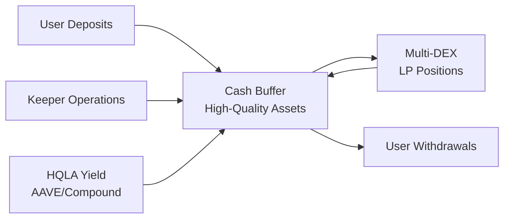

# BTR Protocol Architecture

## Overview

BTR Protocol implements **automated liquidity management across multiple DEXs** using the **Diamond Standard (EIP-2535)** for modular, upgradeable smart contracts. The protocol's first primitive is the **Automated Liquidity Manager (ALM)**, which optimizes total value locked (TVL) allocation across liquidity pools from Uniswap V3/V4, PancakeSwap V3, Thena, and other compatible DEX protocols.

## Core Architecture

### Diamond Pattern Structure

```mermaid
graph TB
    subgraph Diamond["BTR Diamond (ERC-2535)"]
        subgraph Technical["Technical Facets"]
            DiamondLoupe[DiamondLoupe]
            DiamondCut[DiamondCut]
        end
        
        subgraph Protocol["Protocol Facets"]
            AccessControl[AccessControl]
            RiskModel[RiskModel]
            Treasury[Treasury]
            Management[Management]
            Rescue[Rescue]
        end
        
        subgraph ALM["ALM Facets"]
            ALMUser[ALMUser]
            ALMProtected[ALMProtected]
            ALMInfo[ALMInfo]
        end
        
        subgraph Info["Information Facets"]
            Oracle[Oracle]
            Info[Info]
        end
    end
    
    subgraph DEXs["Multi-DEX Network"]
        UniV3[Uniswap V3]
        UniV4[Uniswap V4]
        PancakeV3[PancakeSwap V3]
        Thena[Thena V3]
        Others[Other Compatible DEXs]
    end
    
    ALM --> DEXs
    Info --> DEXs
```

### Design Principles

1. **Modularity**: Diamond pattern enables independent facet upgrades without full system redeployment
2. **Multi-DEX Architecture**: Protocol-agnostic design supports any Uniswap V3-compatible DEX
3. **Gas Optimization**: ERC-1155 vaults and cash buffer system minimize transaction costs
4. **Risk Management**: Composite scoring and weight allocation across DEX pools

## Core Components

### ALM Vault System

**Implementation**: ERC-1155 multi-token vaults for gas efficiency
- Single diamond contract manages multiple vaults
- Each vault represents a token pair strategy (e.g., USDC/WETH)
- Ranges distribute liquidity across multiple DEX pools with configurable weights

**Reference**: [`evm/src/facets/ALMUserFacet.sol`](../evm/src/facets/ALMUserFacet.sol)

### Multi-DEX Integration

**Adapter Pattern**: Abstract base classes enable consistent DEX integration
- `DEXAdapterFacet`: Common DEX operations interface
- `V3AdapterFacet`: Uniswap V3-style DEX implementation
- Specific adapters: UniV3, PancakeV3, Thena

**Benefits**: 
- Protocol-agnostic liquidity deployment
- Risk diversification across DEX protocols
- Unified user interface despite backend complexity

**Reference**: [`evm/src/facets/adapters/`](../evm/src/facets/adapters/)

### Cash Buffer Architecture

**Purpose**: Gas optimization and liquidity management, not asset quality concerns



**Economic Model**:
- Target cash ratio decreases with vault scale (7.4% at $1M → 5.0% at $100M TVL)
- Cash reserves invested in yield-generating, instantly redeemable positions
- 70%+ gas cost reduction for users vs direct DEX interaction

### Access Control System

**Role-Based Permissions**:
- `ADMIN_ROLE`: Protocol configuration and emergency controls
- `MANAGER_ROLE`: Vault configuration and range weight management  
- `KEEPER_ROLE`: Rebalancing operations and range management
- `TREASURY_ROLE`: Fee collection and treasury operations

**Reference**: [`docs/access-control/roles.md`](./access-control/roles.md)

## Allocation Methodology

### Composite Scoring (cScore)

Each DEX pool receives a composite score based on:
1. **Trust Score**: Protocol security, audits, decentralization
2. **Liquidity Score**: TVL depth, volume, capital efficiency
3. **Performance Score**: Fee generation, impermanent loss metrics

**Formula**: `cScore = (trustScore × liquidityScore × performanceScore)^(1/3)`

### Weight Allocation

**Exponential Weighting**: `weight_i = (cScore_i)^exponent`
- Higher scores receive disproportionately more allocation
- Dynamic max weight per pool ensures diversification
- Iterative redistribution algorithm prevents over-concentration

**Reference**: [`docs/vault-allocation.md`](./vault-allocation.md)

## Security Architecture

### Multi-Layer Protection

1. **Contract Level**: Reentrancy guards, pausability, input validation
2. **Protocol Level**: Role-based access control, timelock for upgrades
3. **Operational Level**: Emergency pause mechanisms, rescue functions

### Risk Management

- **Diversification**: Maximum allocation limits per DEX pool
- **Liquidity Buffers**: Cash reserves for emergency liquidations
- **Upgrade Safety**: Diamond cuts with security review process

**Reference**: [`docs/security/`](./security/)

## Gas Optimization

### Core Strategies

1. **Batch Operations**: Multiple ranges managed in single transactions
2. **Storage Optimization**: Packed structs, minimal storage reads
3. **ERC-1155**: Shared vault contract reduces deployment costs
4. **Cash Buffer**: Eliminates per-transaction DEX interactions

### Performance Metrics

- User operations: $1-4 gas cost vs $15-50 for direct DEX interaction
- Batch efficiency: Thousands of user operations amortized across single keeper transactions
- Storage optimization: ~70% reduction in storage slot usage

## Integration Patterns

### External Systems

1. **Oracle Integration**: Multi-DEX price feeds and TWAP calculations
2. **Keeper Networks**: Automated rebalancing and range management
3. **Frontend Systems**: Read-only vault analytics and user interfaces
4. **Bridge Support**: Cross-chain asset management (future)

### API Standardization

- Consistent interface patterns across all facets
- Standardized error handling and event emission
- Preview functions for all user operations

**Reference**: [`evm/interfaces/`](../evm/interfaces/)

## Upgrade Mechanism

### Diamond Cuts

**Process**:
1. Develop and test new facet implementations
2. Create diamond cut proposal with function selector mappings
3. Security review and multi-sig approval
4. Execute diamond cut with timelock protection
5. Verify successful upgrade and functionality

**Safety Measures**:
- Timelock delays for sensitive upgrades
- Multi-signature requirements for major changes
- Rollback capability for problematic deployments

## Future Architecture

### Planned Enhancements

1. **Cross-Chain Support**: Multi-chain vault management and asset bridging
2. **Asset Expansion**: Support for additional stable and volatile asset pairs
3. **CDO Integration**: Vault share collateralization for liquid token minting
4. **Leverage Mechanisms**: Multiple leverage paths for enhanced capital efficiency

### Scalability Considerations

- Layer 2 deployment strategies
- Cross-chain interoperability protocols
- Advanced oracle aggregation systems
- Automated market maker integrations

---

**Documentation Structure**:
- **Implementation Details**: [`docs/alm/`](./alm/)
- **User Flows**: [`docs/alm/user-flows.md`](./alm/user-flows.md)
- **Protocol Flows**: [`docs/alm/protocol-flows.md`](./alm/protocol-flows.md)
- **Metrics & Analytics**: [`docs/metrics/`](./metrics/)
