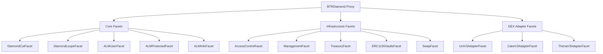

# BTR Supply Deployment Guide

## Overview

This guide covers the complete deployment process for BTR Supply contracts on EVM-compatible chains. The system uses the Diamond Standard (EIP-2535) for modular deployment and upgrades.

## Prerequisites

### Environment Setup

1. **Required Tools**:
   ```bash
   # Install Foundry
   curl -L https://foundry.paradigm.xyz | bash
   foundryup
   
   # Install Python dependencies
   pip install uv
   uv sync
   ```

2. **Environment Configuration**:
   ```bash
   cp evm/.env.example evm/.env
   # Configure the following variables:
   ```

   **Required Environment Variables**:
   ```bash
   # Network Configuration
   HTTPS_RPC_1=rpc.mevblocker.io     # Ethereum
   # ...
   
   # Deployment Keys
   DEPLOYER_PK=0x...                 # Deployer private key
   ADMIN=0x...                       # Protocol admin
   MANAGER=0x...                     # Vault manager
   KEEPER=0x...                      # Rebalancing keeper
   TREASURY=0x...                    # Fee collector
   
   # Verification
   ETHERSCAN_API_KEY=...             # Contract verification
   BSCSCAN_API_KEY=...
   POLYGONSCAN_API_KEY=...
   ```

### Build Process

The project uses a three-stage build process:

```bash
# Complete build with facet generation
make build

# Or manually:
./scripts/build.sh
```

**Build Stages**:
1. **Facet Compilation**: Compiles all facet contracts
2. **Deployer Generation**: Creates deployment script from `facets.json`
3. **Final Compilation**: Compiles complete system

## Deployment Architecture

### Diamond Deployment Structure



## Deployment Process

### 1. Pre-Deployment Verification

```bash
# Verify build
forge build --root evm/

# Run tests
forge test --root evm/

# Check gas estimates
forge snapshot --root evm/
```

### 2. Deploy Diamond and Core Facets

```bash
# Deploy to local network (for testing)
anvil &
forge script evm/scripts/DeployDiamond.s.sol --rpc-url http://localhost:8545 --broadcast

# Deploy to testnet
forge script evm/scripts/DeployDiamond.s.sol --rpc-url $TESTNET_RPC --broadcast --verify

# Deploy to mainnet (requires additional confirmations)
forge script evm/scripts/DeployDiamond.s.sol --rpc-url $MAINNET_RPC --broadcast --verify --slow
```

### 3. Deployment Script Overview

The main deployment script (`DeployDiamond.s.sol`) performs:

```solidity
contract DeployDiamond is Script {
    function run() external {
        uint256 deployerPrivateKey = vm.envUint("DEPLOYER_PRIVATE_KEY");
        vm.startBroadcast(deployerPrivateKey);
        
        // 1. Deploy all facets
        deployFacets();
        
        // 2. Deploy diamond with initial cuts
        deployDiamond();
        
        // 3. Initialize all facets
        initializeFacets();
        
        // 4. Set up access control
        setupAccessControl();
        
        // 5. Configure initial parameters
        configureProtocol();
        
        vm.stopBroadcast();
    }
}
```

### 4. Facet Deployment Order

**Phase 1: Core Infrastructure**
```solidity
// Essential diamond functionality
DiamondCutFacet cutFacet = new DiamondCutFacet();
DiamondLoupeFacet loupeFacet = new DiamondLoupeFacet();

// Access control (required for other initializations)
AccessControlFacet accessFacet = new AccessControlFacet();
```

**Phase 2: Protocol Management**
```solidity
// Management and treasury
ManagementFacet managementFacet = new ManagementFacet();
TreasuryFacet treasuryFacet = new TreasuryFacet();
RescueFacet rescueFacet = new RescueFacet();

// Swap functionality
SwapFacet swapFacet = new SwapFacet();
```

**Phase 3: ALM Core**
```solidity
// Vault management
ERC1155VaultsFacet vaultsFacet = new ERC1155VaultsFacet();

// ALM operations
ALMUserFacet userFacet = new ALMUserFacet();
ALMProtectedFacet protectedFacet = new ALMProtectedFacet();
ALMInfoFacet infoFacet = new ALMInfoFacet();
```

**Phase 4: DEX Adapters**
```solidity
// DEX integrations
UniV3AdapterFacet uniV3Facet = new UniV3AdapterFacet();
CakeV3AdapterFacet cakeV3Facet = new CakeV3AdapterFacet();
ThenaV3AdapterFacet thenaFacet = new ThenaV3AdapterFacet();
```

### 5. Diamond Cut Assembly

```solidity
function assembleDiamondCut() internal returns (IDiamondCut.FacetCut[] memory cuts) {
    cuts = new IDiamondCut.FacetCut[](facetCount);
    
    // Add each facet with its function selectors
    cuts[0] = IDiamondCut.FacetCut({
        facetAddress: address(cutFacet),
        action: IDiamondCut.FacetCutAction.Add,
        functionSelectors: getCutSelectors()
    });
    
    // ... continue for all facets
}
```

## Post-Deployment Configuration

### 1. Access Control Setup

```solidity
// Grant initial roles
accessControl.grantRole(ADMIN_ROLE, adminAddress);
accessControl.grantRole(MANAGER_ROLE, managerAddress);
accessControl.grantRole(KEEPER_ROLE, keeperAddress);
accessControl.grantRole(TREASURY_ROLE, treasuryAddress);

// Configure role hierarchies
accessControl.setRoleAdmin(MANAGER_ROLE, ADMIN_ROLE);
accessControl.setRoleAdmin(KEEPER_ROLE, ADMIN_ROLE);
accessControl.setRoleAdmin(TREASURY_ROLE, ADMIN_ROLE);
```

### 2. Protocol Configuration

```solidity
// Initialize core components
managementFacet.initializeManagement();
treasuryFacet.initializeTreasury(treasuryAddress);
swapFacet.initializeSwap();

// Set default fee structure
treasuryFacet.setDefaultFees(500, 500, 200, 2000, 100); // entry, exit, mgmt, perf, flash (BPS)

// Configure risk parameters
managementFacet.setRiskModel(riskModel);
managementFacet.setWeightModel(weightModel);
managementFacet.setLiquidityModel(liquidityModel);
```

### 3. DEX Adapter Registration

```solidity
// Register Uniswap V3 adapter
almProtected.setDexAdapter(DEX.UNI_V3, address(uniV3Facet));

// Register PancakeSwap V3 adapter  
almProtected.setDexAdapter(DEX.CAKE_V3, address(cakeV3Facet));

// Register Thena adapter
almProtected.setDexAdapter(DEX.THENA_V3, address(thenaFacet));
```

### 4. Pool Registration

```solidity
// Example: Register USDC/USDT pool on Uniswap V3
PoolInfo memory poolInfo = PoolInfo({
    id: keccak256(abi.encodePacked("USDC_USDT_UNI_V3_100")),
    adapter: address(uniV3Facet),
    pool: 0x3416cF6C708Da44DB2624D63ea0AAef7113527C6, // Actual pool address
    token0: 0xA0b86a33E6441c8C62c0b22E96B4b0a86b95c0ad,  // USDC
    token1: 0xdAC17F958D2ee523a2206206994597C13D831ec7,  // USDT
    fee: 100,      // 0.01% fee tier
    tickSpacing: 1
});

almProtected.setPoolInfo(poolInfo.id, poolInfo);
```

## Deployment Verification

### 1. Contract Verification

```bash
# Verify all contracts
forge verify-contract --chain-id 1 \
    --num-of-optimizations 200 \
    --watch \
    --constructor-args $(cast abi-encode "constructor(address)" $INIT) \
    --etherscan-api-key $ETHERSCAN_API_KEY \
    $DIAMOND \
    src/BTRDiamond.sol:BTRDiamond

# Verify each facet
for facet in $FACETES; do
    forge verify-contract --chain-id 1 \
        --num-of-optimizations 200 \
        --etherscan-api-key $ETHERSCAN_API_KEY \
        $facet \
        src/facets/$(get_facet_name $facet).sol:$(get_facet_name $facet)
done
```

### 2. Functional Verification

```solidity
// Verify diamond functionality
assert(IDiamondLoupe(diamond).facets().length > 0);
assert(IDiamondLoupe(diamond).facetFunctionSelectors(address(cutFacet)).length > 0);

// Verify access control
assert(IAccessControl(diamond).hasRole(ADMIN_ROLE, adminAddress));
assert(IAccessControl(diamond).hasRole(MANAGER_ROLE, managerAddress));

// Verify facet initialization
assert(IManagement(diamond).isInitialized());
assert(ITreasury(diamond).treasury() == treasuryAddress);
```

### 3. Integration Testing

```bash
# Run integration tests against deployed contracts
DIAMOND=$DEPLOYED forge test --match-contract Integration --rpc-url $RPC_URL
```

## Chain-Specific Considerations

### BNB Chain (BSC)

```bash
# BSC deployment considerations
export CHAIN_ID=56
export GAS_PRICE=5000000000  # 5 gwei
export GAS_LIMIT=8000000

# BSC-specific pools to register
# PancakeSwap V3 pools
# Thena pools
```

### Polygon

```bash
# Polygon deployment considerations  
export CHAIN_ID=137
export GAS_PRICE=50000000000  # 50 gwei
export GAS_LIMIT=8000000

# Register Uniswap V3 pools on Polygon
```

### Ethereum Mainnet

```bash
# Mainnet deployment (higher gas considerations)
export CHAIN_ID=1
export GAS_PRICE=20000000000  # 20 gwei
export GAS_LIMIT=8000000

# Use slower deployment for safety
--slow --watch flags
```

## Upgrade Procedures

### 1. Facet Upgrades

```solidity
// Deploy new facet version
NewFacet newFacet = new NewFacet();

// Prepare diamond cut
IDiamondCut.FacetCut[] memory cuts = new IDiamondCut.FacetCut[](1);
cuts[0] = IDiamondCut.FacetCut({
    facetAddress: address(newFacet),
    action: IDiamondCut.FacetCutAction.Replace,
    functionSelectors: getReplacementSelectors()
});

// Execute upgrade (requires admin role)
IDiamondCut(diamond).diamondCut(cuts, address(0), "");
```

### 2. New Facet Addition

```solidity
// Add new functionality
IDiamondCut.FacetCut[] memory cuts = new IDiamondCut.FacetCut[](1);
cuts[0] = IDiamondCut.FacetCut({
    facetAddress: address(newFacet),
    action: IDiamondCut.FacetCutAction.Add,
    functionSelectors: getNewSelectors()
});

IDiamondCut(diamond).diamondCut(cuts, address(newFacet), initCalldata);
```

## Monitoring and Maintenance

### 1. Deployment Monitoring

```bash
# Monitor deployment transaction
cast receipt $DEPLOYMENT_TX_HASH --rpc-url $RPC_URL

# Verify contract state
cast call $DIAMOND "vaultCount()" --rpc-url $RPC_URL
```

### 2. Health Checks

```solidity
// Regular health check functions
function healthCheck() external view returns (bool) {
    // Verify critical functionality
    require(IAccessControl(diamond).hasRole(ADMIN_ROLE, admin), "Admin missing");
    require(ITreasury(diamond).treasury() != address(0), "Treasury not set");
    require(IManagement(diamond).isInitialized(), "Not initialized");
    return true;
}
```

### 3. Emergency Procedures

```solidity
// Emergency pause (admin only)
IManagement(diamond).pause();

// Emergency asset rescue (with timelock)
IRescue(diamond).requestRescue(tokens, recipient);
// ... wait for timelock
IRescue(diamond).executeRescue(tokens, recipient);
```

## Security Considerations

### 1. Role Management

- **Multi-sig wallets** for admin roles
- **Timelock contracts** for critical operations
- **Role rotation** procedures
- **Emergency response** protocols

### 2. Upgrade Safety

- **Comprehensive testing** before upgrades
- **Staged rollouts** for major changes
- **Rollback procedures** for failed upgrades
- **Community notification** for significant changes

### 3. Operational Security

- **Private key management** using hardware wallets
- **Deployment verification** through multiple sources
- **Access control monitoring** and alerting
- **Regular security audits** and updates

This deployment guide ensures secure, reliable deployment of the BTR Supply protocol across multiple EVM-compatible chains. 
