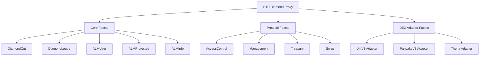

# BTR Protocol Deployment Guide

## Overview

This guide covers the deployment process for BTR Protocol contracts using the Diamond Standard (EIP-2535) for modular deployment and upgrades across EVM-compatible chains.

## Architecture

### Diamond Deployment Pattern

BTR Protocol uses a single diamond proxy contract that delegates function calls to multiple specialized facets. This enables:

- **Modular Deployment**: Individual facets can be upgraded independently
- **Gas Optimization**: Shared proxy contract reduces deployment costs
- **Flexible Architecture**: New functionality added via diamond cuts

### Function Selector Management

BTR Protocol facets use function selectors to route calls through the diamond proxy. The deployment system handles function selectors with automatic extraction and optional explicit overrides:

#### **Automatic Function Extraction (Default Behavior)**
When `ownedSelectors` is empty (`[]`) in `contracts.json`, **ALL public/external functions are automatically extracted** from the facet's compiled artifacts in `./evm/out`. This is the normal case for most facets.

**Example**: `RescueFacet` with `"ownedSelectors": []` → System extracts all 37 functions from `RescueFacet.json`

#### **Explicit Selector Override (Special Cases)**
When `ownedSelectors` contains specific function signatures, **only those exact functions are used**. This is for facets with conflicting function names or when precise control is needed.

**Example**: `AccessControlFacet` with explicit selectors like `["admin()", "checkRole(bytes32)"]` → System uses only those specific functions

#### **Key Points**
- **Empty `ownedSelectors: []` ≠ No Functions**: It means "extract all functions automatically"
- **Populated `ownedSelectors` = Override**: It means "use only these specific functions"
- **All facets get their functions**: Whether through automatic extraction or explicit specification
- **No functions are missed**: The system ensures complete function mapping to prevent proxy call failures

**Configuration**: See `scripts/contracts.json` for facet configuration. Most facets use automatic extraction (`"ownedSelectors": []`).

### Deployment Structure



## Prerequisites

### Environment Requirements

1. **Development Tools**:
   - Foundry (latest version)
   - Python 3.10+ with `uv` package manager
   - Node.js (for optional frontend integration)

2. **Network Configuration**:
   - RPC endpoints for target networks
   - Sufficient ETH/native tokens for deployment gas
   - API keys for contract verification (Etherscan, etc.)

3. **Access Control Setup**:
   - Deployer wallet with sufficient funds
   - Admin wallet for protocol governance
   - Manager wallet for vault operations
   - Keeper wallet for automated operations
   - Treasury wallet for fee collection

**Reference**: [`.env.example`](../evm/.env.example) for complete configuration template

### Build System

BTR Protocol uses a multi-stage build process:

```bash
# Complete build pipeline
make build

# Individual stages
make compile-facets    # Compile all facet contracts
make generate-script   # Generate deployment script
make compile-all       # Final compilation
```

**Build Process**:
1. **Facet Compilation**: Individual facet contracts compiled independently
2. **Deployment Script Generation**: Automated script generation from facet metadata
3. **Diamond Assembly**: Combined compilation with diamond proxy

**Reference**: [`scripts/build.sh`](../scripts/build.sh)

## Deployment Process

### Network Deployment

BTR Protocol supports deployment across multiple EVM networks:

#### Testnet Deployment
```bash
# Deploy to testnet (e.g., Sepolia)
forge script evm/scripts/DeployDiamond.s.sol --rpc-url $TESTNET_RPC --broadcast --verify
```

#### Mainnet Deployment
```bash
# Deploy to mainnet with additional safety checks
forge script evm/scripts/DeployDiamond.s.sol --rpc-url $MAINNET_RPC --broadcast --verify --slow
```

#### Local Development
```bash
# Deploy to local Anvil instance
anvil &
forge script evm/scripts/DeployDiamond.s.sol --rpc-url http://localhost:8545 --broadcast
```

### Deployment Phases

1. **Facet Deployment**: All facet contracts deployed independently
2. **Diamond Creation**: Proxy contract created with initial diamond cut
3. **Facet Integration**: Function selectors mapped to facet addresses
4. **Initialization**: Protocol parameters and access controls configured
5. **Verification**: Contract verification on block explorers

**Reference**: [`evm/scripts/DeployDiamond.s.sol`](../evm/scripts/DeployDiamond.s.sol)

## Post-Deployment Configuration

### Access Control Setup

After deployment, configure role-based access control:

1. **Admin Role**: Protocol governance and emergency controls
2. **Manager Role**: Vault configuration and parameter management
3. **Keeper Role**: Automated rebalancing and range management
4. **Treasury Role**: Fee collection and treasury operations

### Initial Parameters

Configure essential protocol parameters:
- Fee structures and basis points
- Risk model parameters
- Oracle price feed configurations
- DEX adapter settings

### DEX Integration

Enable DEX adapters for target protocols:
- Uniswap V3/V4 pool configurations
- PancakeSwap V3 integration
- Thena DEX setup
- Additional protocol adapters as needed

**Reference**: [`docs/access-control/`](./access-control/) for detailed configuration

## Network-Specific Considerations

### Ethereum Mainnet
- **Gas Optimization**: Deployment during low network congestion
- **MEV Protection**: Use private mempools for sensitive transactions
- **Multi-sig Requirements**: Admin operations require multi-signature approval

### Layer 2 Networks
- **Polygon**: Lower gas costs, faster finalization
- **Arbitrum**: Optimistic rollup benefits for high-frequency operations
- **Optimism**: Lower fees for user interactions

### BSC and Alternative Chains
- **Binance Smart Chain**: PancakeSwap integration priority
- **Avalanche**: Trader Joe and other DEX protocols
- **Fantom**: SpookySwap and Solidly-based DEXs

## Upgrade Mechanism

### Diamond Cuts

BTR Protocol supports safe upgrades via diamond cuts:

1. **Facet Development**: New facet implementation development and testing
2. **Diamond Cut Proposal**: Create upgrade proposal with function selector mappings
3. **Security Review**: Internal and external security validation
4. **Timelock Execution**: Delayed execution for sensitive upgrades
5. **Upgrade Verification**: Post-upgrade functionality validation

### Safety Mechanisms

- **Timelock Delays**: Mandatory delays for major protocol changes
- **Multi-signature Approval**: Required approvals for sensitive operations
- **Rollback Capability**: Ability to revert problematic upgrades
- **Incremental Deployment**: Gradual rollout of new features

**Reference**: [`docs/security/`](./security/) for upgrade security practices

## Monitoring and Maintenance

### Post-Deployment Monitoring

1. **Contract Verification**: Ensure all contracts verified on block explorers
2. **Function Testing**: Validate all user and admin functions work correctly
3. **Gas Usage**: Monitor gas costs for optimization opportunities
4. **Event Emission**: Verify correct event emission for off-chain monitoring

### Ongoing Maintenance

- **Keeper Operations**: Monitor automated rebalancing functionality
- **Oracle Health**: Validate price feed accuracy and availability
- **Treasury Management**: Monitor fee collection and distribution
- **Security Monitoring**: Watch for unusual activity or potential issues

## Troubleshooting

### Common Deployment Issues

1. **Gas Estimation Failures**: Increase gas limits or deploy during lower congestion
2. **Verification Failures**: Ensure correct compiler version and optimization settings
3. **Access Control Issues**: Verify correct wallet addresses in environment configuration
4. **Network Configuration**: Validate RPC endpoints and network chain IDs

### Support Resources

- **Build System**: [`Makefile`](../Makefile) for available commands
- **Test Suite**: [`evm/test/`](../evm/test/) for comprehensive testing
- **Documentation**: [`docs/`](.) for detailed protocol documentation
- **Configuration**: [`evm/foundry.toml`](../evm/foundry.toml) for build settings

---

**Next Steps After Deployment**:
- **Vault Creation**: [`docs/alm/protocol-flows.md`](./alm/protocol-flows.md)
- **User Integration**: [`docs/alm/user-flows.md`](./alm/user-flows.md)
- **Management Operations**: [`docs/management/`](./management/)
- **Security Practices**: [`docs/security/`](./security/)
