# Management Protocol Flows

This document outlines the management and protocol parameter operations within the BTR protocol, focusing on system configuration, restrictions management, and administrative controls performed by admins and managers through the ManagementFacet.

## Overview

The BTR management system provides comprehensive protocol control through:

- **Protocol Configuration**: Version management and core parameter settings
- **Access Restrictions**: Account status management and operation restrictions
- **Fee Management**: Custom fee configuration for specific users
- **System Controls**: Pause/unpause functionality and emergency controls

## Management Architecture

### Core Components

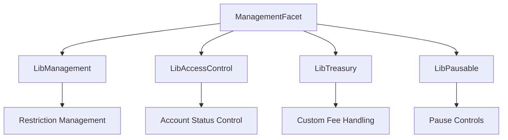

### Management Storage

```solidity
struct ManagementStorage {
    bool restrictSwapCaller;
    bool restrictSwapRouter;
    bool restrictSwapInput;
    bool restrictSwapOutput;
    bool restrictBridgeInput;
    bool restrictBridgeOutput;
    bool restrictBridgeRouter;
    bool approveMax;
    bool autoRevoke;
}
```

## Management Initialization

### 1. Management System Setup

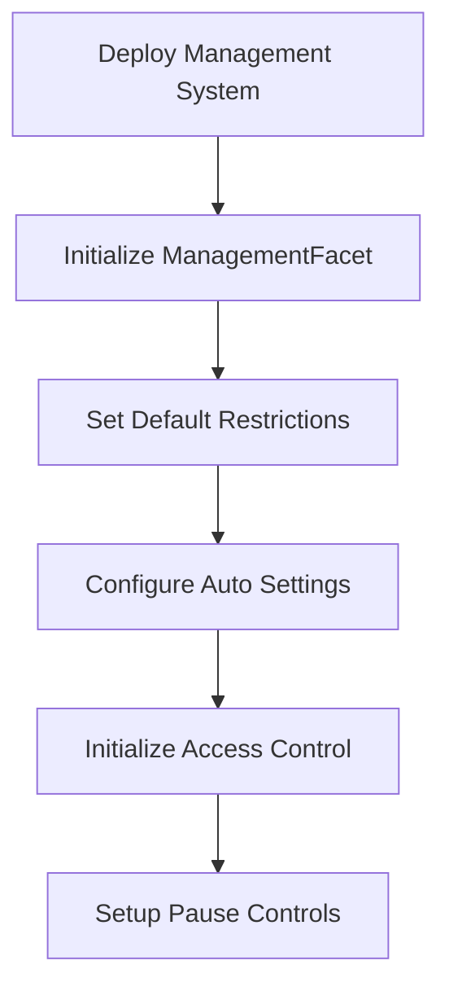

**Function**: `ManagementFacet.initializeManagement()`

**Initial Configuration**:
- Set restriction defaults (all false except approveMax/autoRevoke)
- Initialize access control integration
- Configure pause/unpause functionality
- Set initial protocol version

## Protocol Configuration

### 1. Version Management

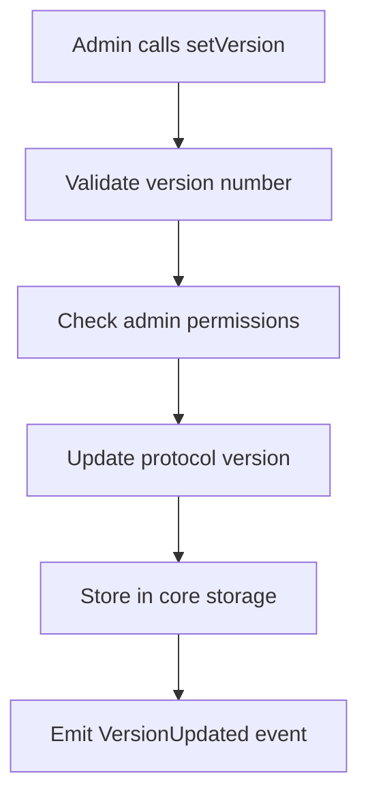

**Function**: `ManagementFacet.setVersion()`

**Parameters**: `_version` - New protocol version (uint8)

**Access Control**: Only admins can set the protocol version

**Usage**: Track protocol upgrades and feature releases

## Pause/Unpause Controls

### 1. System Pause

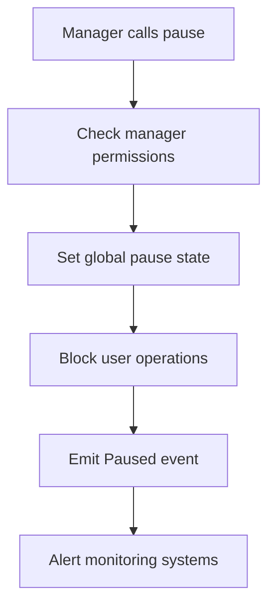

**Function**: `ManagementFacet.pause()`

**Access Control**: Only managers can pause the system

**Effects**:
- Blocks all user operations (deposits, withdrawals, swaps)
- Allows emergency management operations
- Maintains system state integrity

### 2. System Unpause

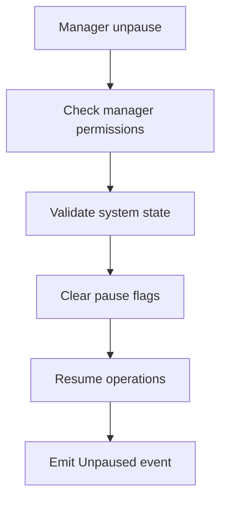

**Function**: `ManagementFacet.unpause()`

**Access Control**: Only managers can unpause the system

**Validation**:
- Ensure system is in pausable state
- Verify no critical issues remain
- Confirm operational readiness

## Account Status Management

### 1. Individual Account Status

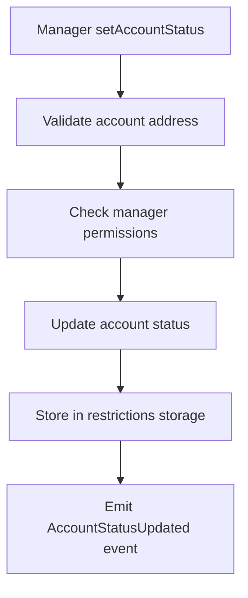

**Function**: `ManagementFacet.setAccountStatus()`

**Parameters**:
- `_account`: Account address to update
- `_status`: New account status (NONE, WHITELISTED, BLACKLISTED)

### 2. Batch Account Status Updates

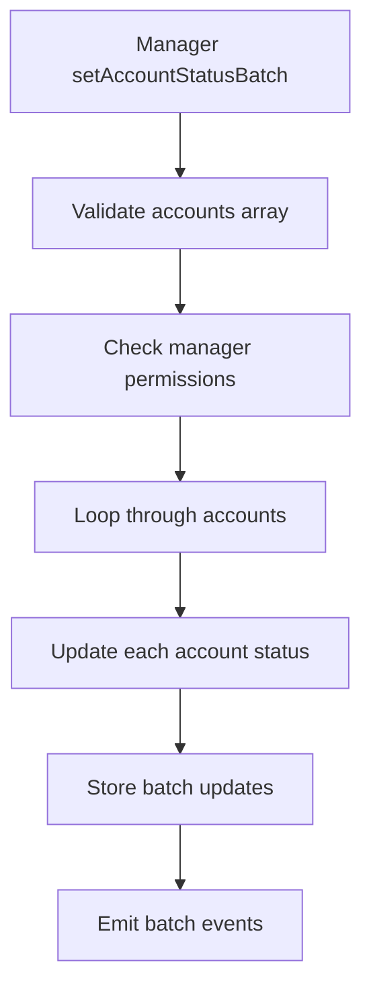

**Function**: `ManagementFacet.setAccountStatusBatch()`

**Parameters**:
- `_accounts`: Array of account addresses
- `_status`: Status to apply to all accounts

**Efficiency**: Gas-optimized batch processing for multiple accounts

### 3. Whitelist Management

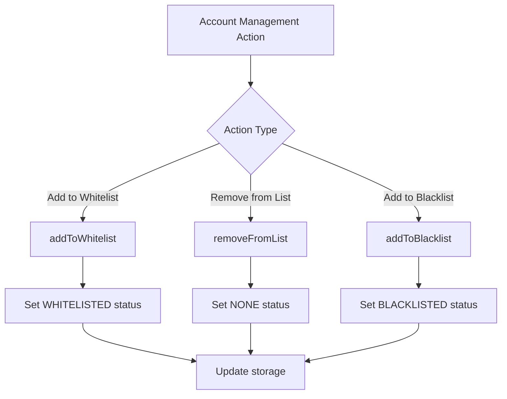

**Functions**:
- `ManagementFacet.addToWhitelist(address _account)`
- `ManagementFacet.removeFromList(address _account)`
- `ManagementFacet.addToBlacklist(address _account)`

### 4. Batch List Management

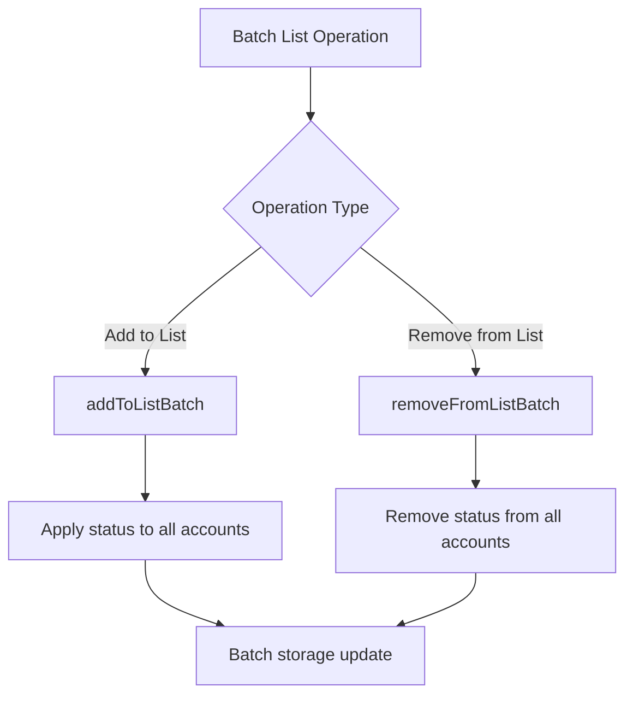

**Functions**:
- `ManagementFacet.addToListBatch(address[] _accounts, AccountStatus _status)`
- `ManagementFacet.removeFromListBatch(address[] _accounts)`

## Operation Restrictions

### 1. Swap Restrictions

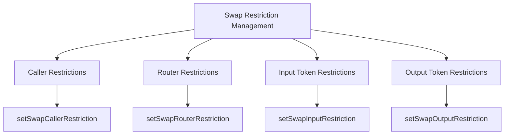

**Functions**:
- `ManagementFacet.setSwapCallerRestriction(bool _value)`
- `ManagementFacet.setSwapRouterRestriction(bool _value)`
- `ManagementFacet.setSwapInputRestriction(bool _value)`
- `ManagementFacet.setSwapOutputRestriction(bool _value)`

**Restriction Effects**:
- **Caller**: Restricts which addresses can initiate swaps
- **Router**: Restricts which router contracts can be used
- **Input**: Restricts which tokens can be swapped from
- **Output**: Restricts which tokens can be swapped to

### 2. Bridge Restrictions

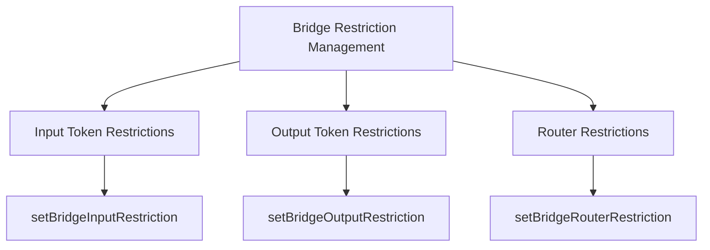

**Functions**:
- `ManagementFacet.setBridgeInputRestriction(bool _value)`
- `ManagementFacet.setBridgeOutputRestriction(bool _value)`
- `ManagementFacet.setBridgeRouterRestriction(bool _value)`

**Restriction Effects**:
- **Input**: Restricts which tokens can be bridged from
- **Output**: Restricts which tokens can be bridged to
- **Router**: Restricts which bridge contracts can be used

### 3. Approval Management

```mermaid
graph TD
    A[Approval Settings] --> B[Approve Max Setting]
    A --> C[Auto Revoke Setting]
    
    B --> D[setApproveMax]
    C --> E[setAutoRevoke]
    
    D --> F{Approve Max Enabled?}
    F -->|Yes| G[Use type(uint256).max]
    F -->|No| H[Use exact amounts]
    
    E --> I{Auto Revoke Enabled?}
    I -->|Yes| J[Revoke after operations]
    I -->|No| K[Keep approvals active]
```

**Functions**:
- `ManagementFacet.setApproveMax(bool _value)`
- `ManagementFacet.setAutoRevoke(bool _value)`

**Effects**:
- **Approve Max**: Allows setting unlimited approvals for specific operations
- **Auto Revoke**: Automatically revokes approvals after use
