# Oracle Protocol Flows

This document outlines the oracle management and data feed operations within the BTR protocol, focusing on price provider configuration, feed management, and oracle adapter deployment performed by managers and automated systems.

## Overview

The BTR oracle system provides decentralized price feeds for multi-chain ALM operations through:

- **Price Providers**: Abstract contracts implementing price conversion logic
- **Oracle Adapters**: Network-specific implementations (Chainlink, Uniswap, etc.)
- **Feed Management**: Configuration and validation of price sources
- **Fallback Mechanisms**: Alternative providers for redundancy

## Oracle Architecture

### Core Components

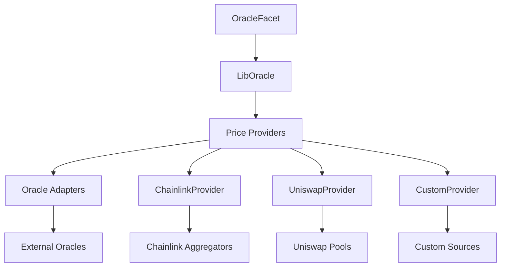

### Provider Hierarchy

- **PriceProvider**: Base abstract contract with USD conversion logic
- **OracleAdapter**: Base abstract contract with feed management
- **Specific Implementations**: ChainlinkProvider, UniswapProvider, etc.

## Oracle Initialization

### 1. Oracle System Setup

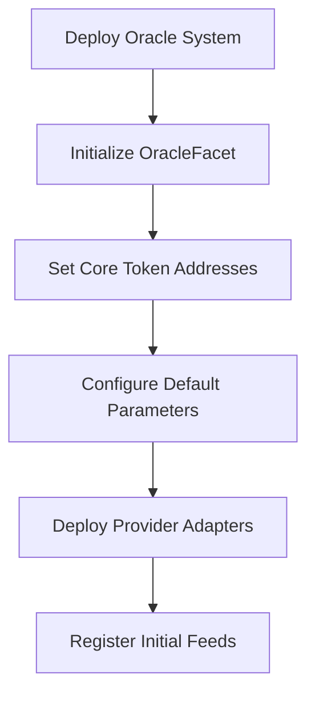

**Function**: `OracleFacet.initializeOracle()`

**Parameters**:
```solidity
struct CoreAddresses {
    address weth;
    address usdc;
    address usdt;
    address btc;
    // Other core protocol tokens
}
```

## Provider Management

### 1. Provider Registration

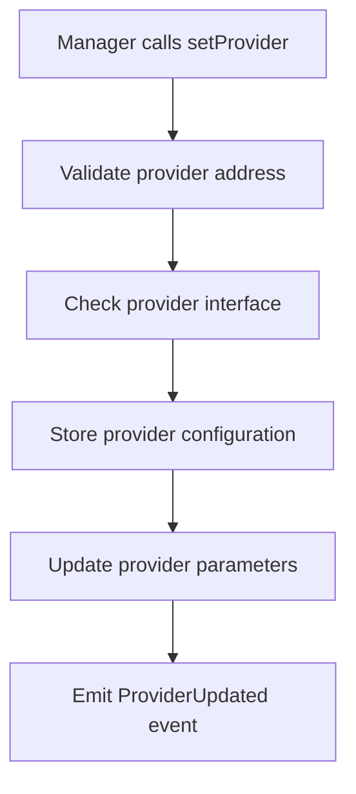

**Function**: `OracleFacet.setProvider()`

**Provider Setup**:
- **New Provider**: `setProvider(address _provider, bytes _params)`
- **Replace Provider**: `setProvider(address _provider, address _replacing, bytes _params)`

### 2. Provider Removal

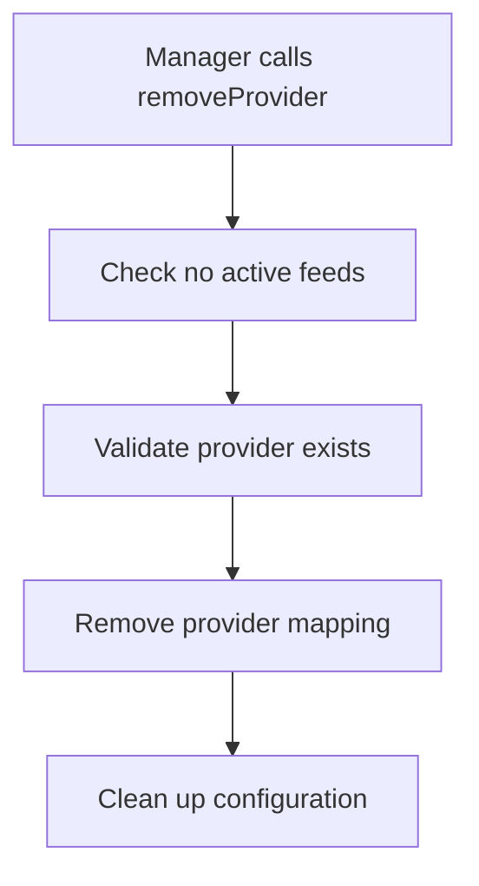

**Function**: `OracleFacet.removeProvider()`

**Validation**:
- Provider must have no active feeds
- Only managers can remove providers
- Cleanup of associated configuration

## Feed Management

### 1. Feed Registration

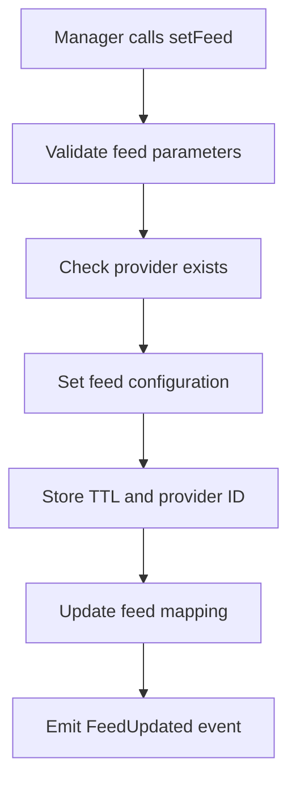

**Function**: `OracleFacet.setFeed()`

**Parameters**:
```solidity
function setFeed(
    bytes32 _feed,        // Feed identifier (typically token address)
    address _provider,    // Provider implementation address
    bytes32 _providerId,  // Provider-specific identifier
    uint256 _ttl         // Time-to-live in seconds
)
```

### 2. Feed Removal

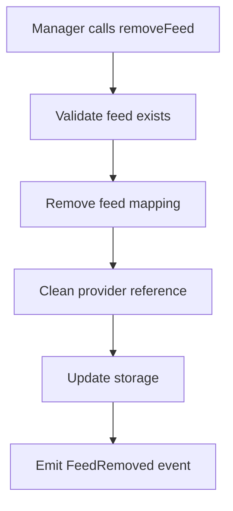

**Function**: `OracleFacet.removeFeed()`

### 3. Batch Feed Operations

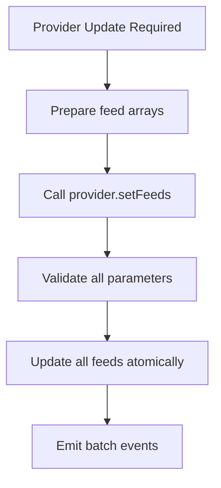

**Provider Function**: `OracleAdapter.setFeeds()`

## Alternative Provider Configuration

### 1. Fallback Setup

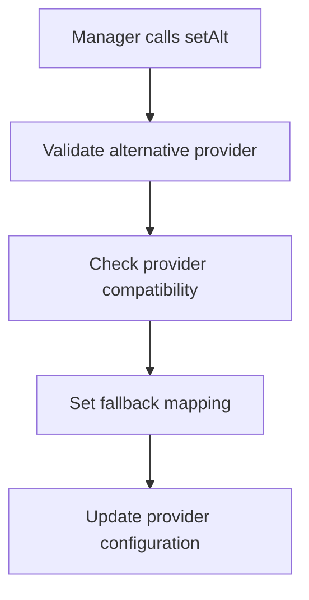

**Function**: `OracleFacet.setAlt()`

**Fallback Logic**:
- Primary provider fails → Try alternative provider
- Alternative provider fails → Revert with stale price error
- Fallback providers must support same interface

### 2. Fallback Removal

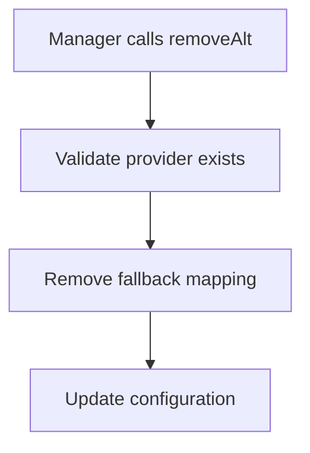

**Function**: `OracleFacet.removeAlt()`

## Configuration Management

### 1. TWAP Lookback Configuration

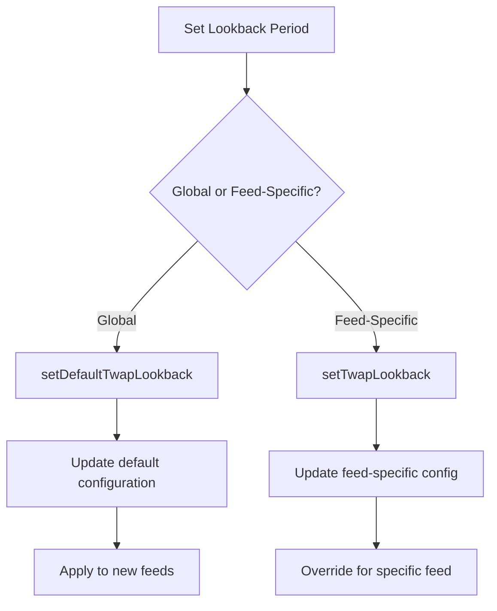

**Functions**:
- `OracleFacet.setDefaultTwapLookback(uint32 _lookback)`
- `OracleFacet.setTwapLookback(bytes32 _feed, uint32 _lookback)`

### 2. Price Deviation Limits

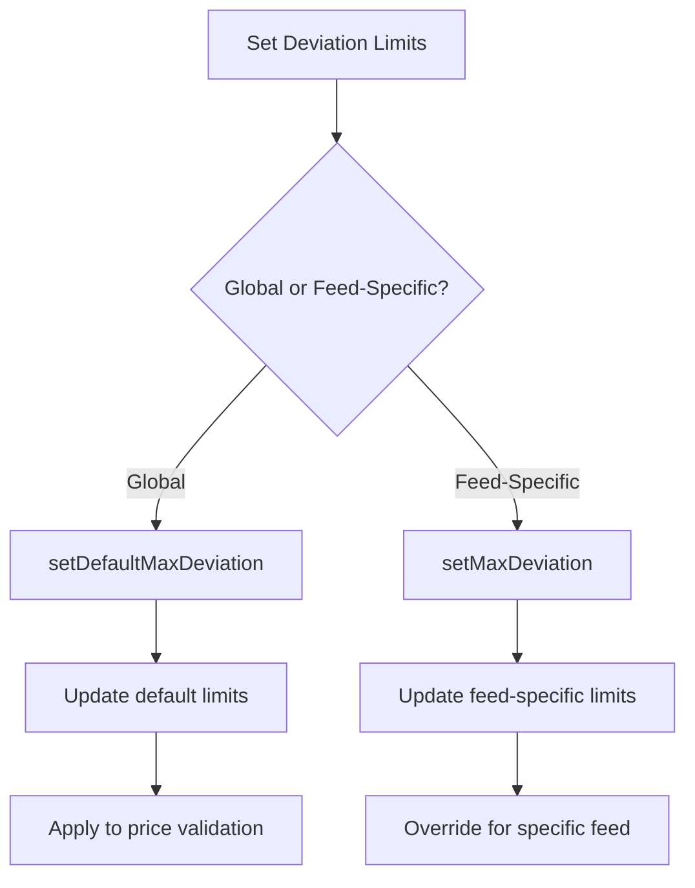

**Functions**:
- `OracleFacet.setDefaultMaxDeviation(uint256 _maxDeviationBp)`
- `OracleFacet.setMaxDeviation(bytes32 _feed, uint256 _maxDeviationBp)`

## Provider Implementation Flows

### 1. Chainlink Provider Setup

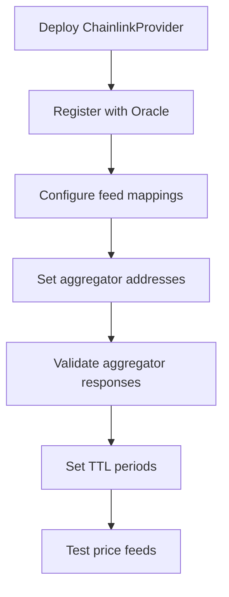

**ChainlinkProvider Configuration**:
```solidity
struct ChainlinkParams {
    bytes32[] feeds;        // Asset identifiers
    bytes32[] providerIds;  // Aggregator addresses
    uint256[] ttls;        // Validity periods
}
```

### 2. Custom Provider Implementation

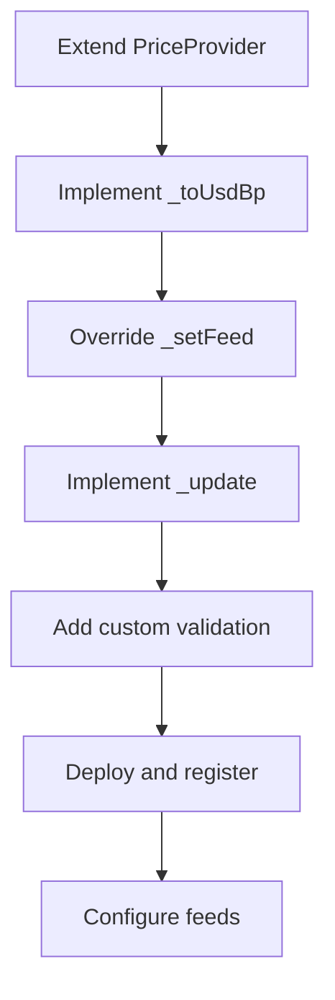

**Implementation Requirements**:
- Extend `PriceProvider` abstract contract
- Implement `_toUsdBp(address _asset, bool _invert)`
- Override feed management functions
- Provide update mechanism

## Price Query Operations

### 1. Basic Price Queries

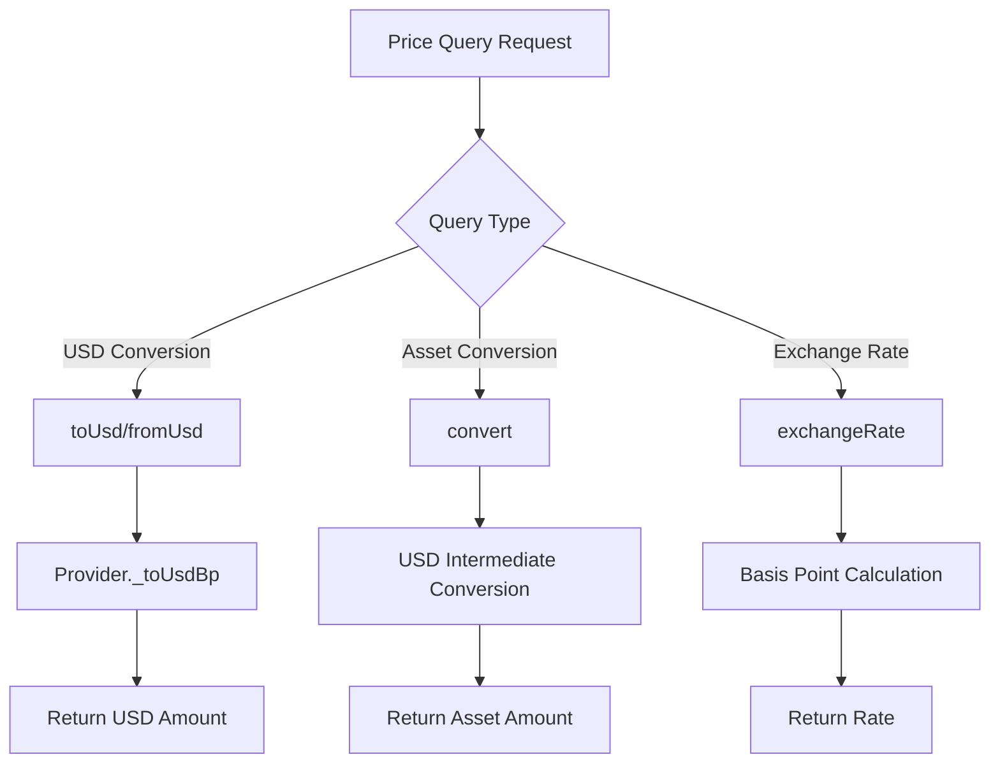

**Query Functions**:
- `toUsd(address _asset, uint256 _amount)`: Convert asset to USD
- `fromUsd(address _asset, uint256 _amount)`: Convert USD to asset
- `convert(address _base, address _quote, uint256 _amount)`: Direct conversion
- `exchangeRate(address _base, address _quote)`: Get exchange rate

### 2. Fallback Price Resolution

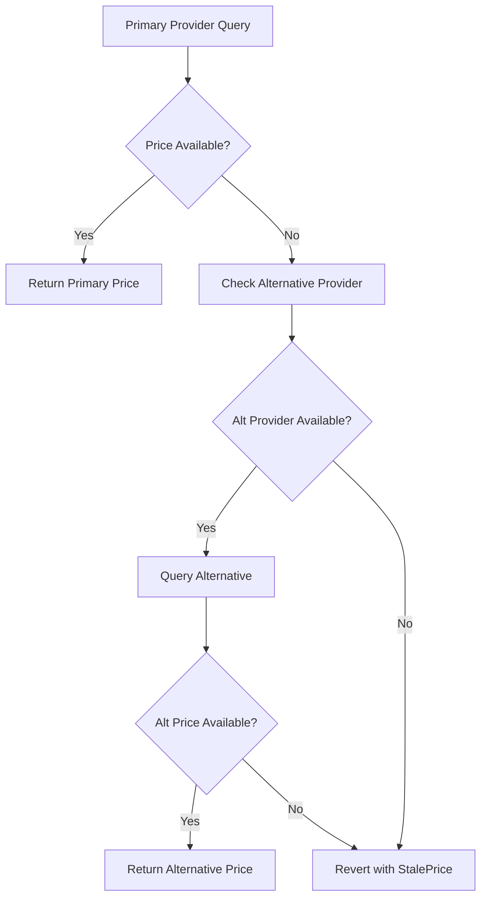

## Oracle Validation

### 1. Price Staleness Checks

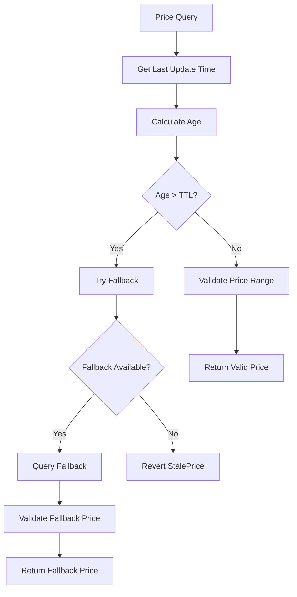

### 2. Price Deviation Validation

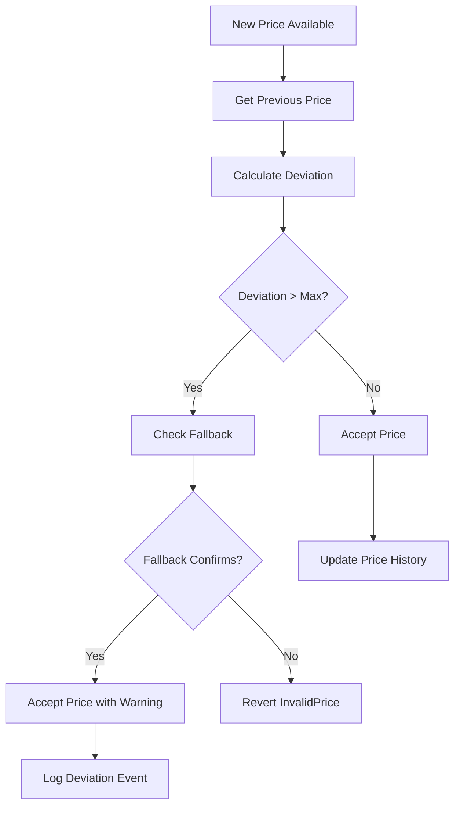

## Monitoring and Maintenance

### 1. Feed Health Monitoring

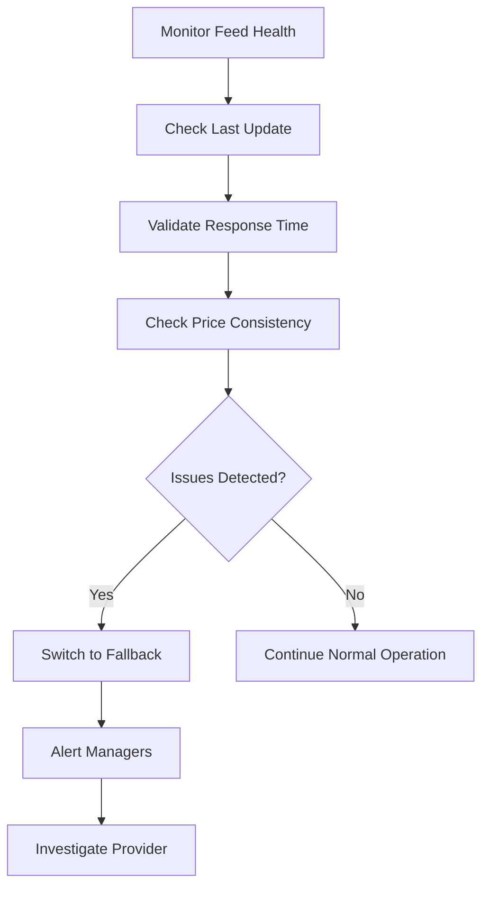

### 2. Provider Maintenance

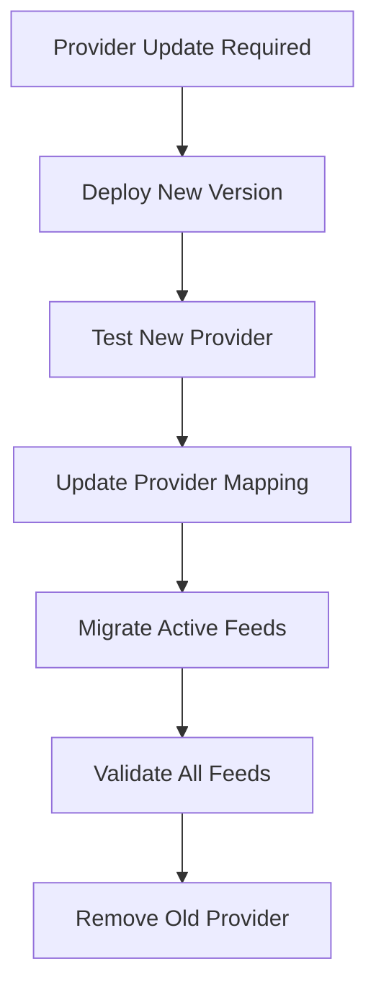

## Error Handling

### Common Error Scenarios

1. **Stale Price**: TTL exceeded, no fallback available
2. **Invalid Price**: Negative or zero price from aggregator
3. **Static Call Failed**: Provider contract not responding
4. **Unexpected Output**: Malformed response from provider

### Recovery Procedures

1. **Feed Failure**: Switch to alternative provider
2. **Provider Failure**: Deploy new provider implementation
3. **Network Issues**: Increase TTL temporarily
4. **Invalid Data**: Remove problematic feed

## Access Control Matrix

| Operation | Admin | Manager | Keeper | Public |
|-----------|-------|---------|--------|--------|
| Initialize Oracle | ✓ | ✗ | ✗ | ✗ |
| Set Provider | ✗ | ✓ | ✗ | ✗ |
| Remove Provider | ✗ | ✓ | ✗ | ✗ |
| Set Feed | ✗ | ✓ | ✗ | ✗ |
| Remove Feed | ✗ | ✓ | ✗ | ✗ |
| Set Alternative | ✗ | ✓ | ✗ | ✗ |
| Configure TWAP | ✗ | ✓ | ✗ | ✗ |
| Set Deviation Limits | ✗ | ✓ | ✗ | ✗ |
| Query Prices | ✗ | ✗ | ✗ | ✓ |
| Check Feed Status | ✗ | ✗ | ✗ | ✓ |

## Integration Examples

### 1. Adding Chainlink Feed

```solidity
// 1. Deploy ChainlinkProvider (if not exists)
ChainlinkProvider provider = new ChainlinkProvider(diamond);

// 2. Register provider
oracleFacet.setProvider(address(provider), encodedParams);

// 3. Set feed for USDC
bytes32 usdcFeed = bytes32(uint256(uint160(USDC_ADDRESS)));
bytes32 aggregatorId = bytes32(uint256(uint160(USDC_CHAINLINK_AGGREGATOR)));
uint256 ttl = 3600; // 1 hour

oracleFacet.setFeed(usdcFeed, address(provider), aggregatorId, ttl);
```

### 2. Setting Up Fallback

```solidity
// Set Uniswap TWAP as fallback for Chainlink
oracleFacet.setAlt(chainlinkProvider, uniswapProvider);
```
This comprehensive oracle protocol flow documentation ensures proper understanding and implementation of all oracle management operations within the BTR protocol.

