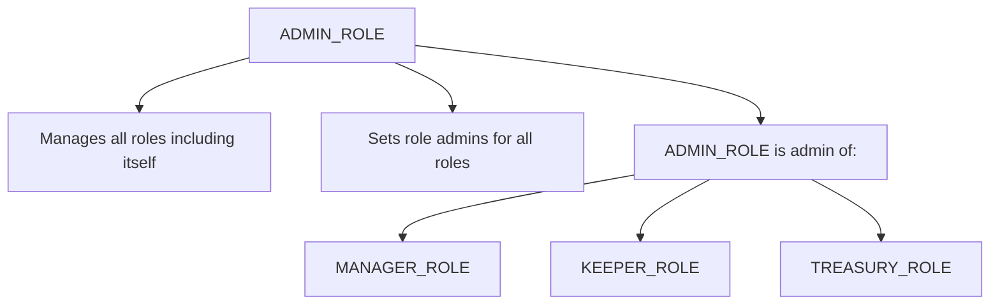

# Access Control Framework

## Overview

The BTR protocol implements a sophisticated role-based access control (RBAC) system built on the Diamond pattern (EIP-2535), ensuring secure multi-chain ALM operations through a hierarchical permission structure with timelock mechanisms and circuit breakers.

## Core Architecture

### Diamond-Centric Access Control

The protocol uses a **Diamond Proxy** as the central authority for all access control decisions:

- **Diamond Storage**: All role data is stored in diamond storage, accessible via `BTRStorage.acc()`
- **Unified Authority**: All facets within the diamond share the same access control state
- **External Contract Integration**: External contracts (adapters, routers) query the diamond for permission validation

### Access Control Components

1. **LibAccessControl.sol**: Core library implementing role logic, timelock mechanisms, and permission checks
2. **AccessControlFacet.sol**: Diamond facet exposing access control functionality (ERC-173 compliant)
3. **PermissionedFacet.sol**: Abstract base for diamond facets requiring role-based access
4. **Permissioned.sol**: Abstract base for external contracts querying diamond for permissions

## Role Hierarchy

### Primary Roles

```solidity
bytes32 public constant ADMIN_ROLE = keccak256("ADMIN_ROLE");
bytes32 public constant MANAGER_ROLE = keccak256("MANAGER_ROLE"); 
bytes32 public constant KEEPER_ROLE = keccak256("KEEPER_ROLE");
bytes32 public constant TREASURY_ROLE = keccak256("TREASURY_ROLE");
```

### Role Responsibilities

#### ADMIN_ROLE (Multisig)
- **Governance**: Ultimate authority over protocol configuration
- **System Control**: Initialize/upgrade facets, manage core protocol parameters
- **Role Administration**: Grant/revoke all roles, set role admins, configure timelocks
- **Emergency Powers**: Asset rescue requests, circuit breaker activation
- **Critical Functions**:
  - Vault creation (`createVault`)
  - Fee structure updates (`setDefaultFees`)
  - Risk model configuration (`setRiskModel`, `setWeightModel`, `setLiquidityModel`)
  - Diamond upgrades (`diamondCut`)
  - Rescue operations (`requestRescue*`)

#### MANAGER_ROLE (Operational Team)
- **Operational Control**: Day-to-day protocol management and configuration
- **Vault Management**: Pause/unpause vaults, set weights, configure pools
- **Risk Management**: Blacklist/whitelist addresses, set restrictions
- **Asset Recovery**: Execute rescue operations (after admin approval)
- **Critical Functions**:
  - Pool configuration (`setPoolInfo`, `setDexAdapter`)
  - Vault parameters (`setWeights`, `pauseAlmVault`, `setMaxSupply`)
  - Access restrictions (`setAccountStatus`, `addToBlacklist/Whitelist`)
  - Rescue execution (`rescue`, `rescueAll`)

#### KEEPER_ROLE (Automated Bots)
- **Automated Operations**: Execute time-sensitive protocol maintenance
- **Rebalancing**: Perform vault rebalances, range management
- **Liquidity Management**: Mint/burn ranges, remint operations
- **No Timelock**: Immediate role grants (operational necessity)
- **Critical Functions**:
  - Rebalancing operations (`rebalance`, `burnRanges`, `mintRanges`)
  - Range management (`remintRanges`)

#### TREASURY_ROLE (Multisig)
- **Fee Collection**: Collect and manage protocol fees
- **Financial Operations**: Handle treasury-related functions
- **Asset Management**: Withdraw collected fees from adapters
- **Critical Functions**:
  - Fee collection (`collectAlmFees`, `collectRangeFees`)

### Role Administration Hierarchy



## Timelock Mechanism

### Configuration

```solidity
uint256 public constant DEFAULT_GRANT_DELAY = 2 days;    // Delay before acceptance
uint256 public constant DEFAULT_ACCEPT_WINDOW = 7 days;  // Acceptance window
uint256 public constant MIN_GRANT_DELAY = 1 days;       // Minimum delay
uint256 public constant MAX_GRANT_DELAY = 30 days;      // Maximum delay
uint256 public constant MIN_ACCEPT_WINDOW = 1 days;     // Minimum window
uint256 public constant MAX_ACCEPT_WINDOW = 30 days;    // Maximum window
```

### Timelock Process

1. **Role Grant**: Admin initiates role grant via `safeGrantRole`
2. **Pending State**: Role enters pending acceptance state
3. **Delay Period**: Must wait `grantDelay` before acceptance
4. **Acceptance Window**: Recipient has `acceptanceTtl` to accept
5. **Acceptance**: Recipient calls `acceptRole` to activate
6. **Replacement**: Optional replacement of existing role holder

### Exemptions

- **KEEPER_ROLE**: No timelock (immediate grants) for operational efficiency
- **First Role Grants**: When no existing role holders exist (bootstrap scenario)

## Diamond Forwarding Pattern

### Internal Facets (PermissionedFacet)

Diamond facets inherit from `PermissionedFacet` and use diamond storage directly:

```solidity
modifier onlyAdmin() virtual {
    AC.checkRole(S.acc(), AC.ADMIN_ROLE);
    _;
}
```

**Access Pattern**: `msg.sender` → Diamond Facet → Diamond Storage

### External Contracts (Permissioned)

External contracts inherit from `Permissioned` and query the diamond:

```solidity
modifier onlyAdmin() virtual {
    diamond.isAdmin(msg.sender);
    _;
}
```

**Access Pattern**: `msg.sender` → External Contract → Diamond Query → Diamond Storage

### Trusted Forwarder Security

#### DEX Adapter Pattern

DEX adapters use a **trusted forwarder** model where the diamond forwards calls:

```solidity
// In DEXAdapter.sol
function mintRange(Range calldata _range, bytes calldata _callbackData) 
    external onlyDiamond returns (...) {
    return _mintRange(_range, msg.sender, _callbackData);
}

function collectRangeFees(Range calldata _range, address _recipient, bytes calldata _callbackData)
    external onlyTreasury returns (...) {
    return _collectRangeFees(_range, _recipient, _callbackData);
}
```

#### Security Model

1. **Diamond Verification**: Adapters only accept calls from the diamond (`onlyDiamond`)
2. **Permission Delegation**: Diamond validates permissions before forwarding
3. **Callback Security**: The diamond controls all callback data passed to adapters
4. **Trust Boundary**: Adapters trust the diamond to perform proper access control

## Permission Validation Patterns

### Internal Diamond Facets

```solidity
// Direct storage access
function someFunction() external onlyManager {
    AC.checkRole(S.acc(), AC.MANAGER_ROLE);
    // Function logic
}
```

### External Contract Integration

```solidity
// Diamond query pattern  
function someFunction() external onlyManager {
    diamond.checkRole(AC.MANAGER_ROLE, msg.sender);
    // Function logic
}
```

### Adapter Integration

```solidity
// Trusted forwarder pattern
function adapterFunction() external onlyDiamond {
    // Diamond has already validated permissions
    // Execute adapter-specific logic
}
```

## Circuit Breaker Mechanisms

### Role Revocation

```solidity
function revokeAll(bytes32 _role) external {
    AC.revokeAll(S.acc(), _role);
}

function revokeAllManagers() external {
    AC.revokeAllManagers(S.acc());
}

function revokeAllKeepers() external {
    AC.revokeAllKeepers(S.acc());
}
```

### Emergency Controls

- **Vault Pausing**: Managers can pause individual vaults (`pauseAlmVault`)
- **Global Pause**: Managers can pause entire protocol (`pause`)
- **Weight Zeroing**: Managers can zero out vault weights (`zeroOutWeights`)
- **Access Revocation**: Admins can revoke all role holders

## Account Status Management

### Status Types

```solidity
enum AccountStatus {
    NONE,        // No restrictions
    WHITELISTED, // Explicitly allowed
    BLACKLISTED  // Explicitly forbidden
}
```

### Restriction Patterns

- **Mint Restrictions**: Vaults can require whitelist for minting
- **Blacklist Enforcement**: Blacklisted accounts are blocked from most operations
- **Whitelist Requirements**: Some operations require explicit whitelisting

## Security Considerations

### Role Escalation Prevention

1. **Self-Administration**: Admin role can only be managed by existing admins
2. **Last Admin Protection**: Cannot revoke the last admin
3. **Timelock Enforcement**: Most role changes require timelock completion
4. **Approval Required**: Role grants must be explicitly accepted

### Trusted Forwarder Risks

1. **Validation Bypass**: Diamond must properly validate all forwarded calls
2. **Callback Injection**: Malicious callback data could exploit adapter logic
3. **Parameter Tampering**: Diamond must sanitize all parameters before forwarding
4. **Permission Confusion**: Clear separation between diamond and adapter permissions

### Multi-Signature Integration

- **Admin Operations**: Require multi-signature approval for critical functions
- **Treasury Operations**: Multi-signature controls fee collection and management
- **Timelock Benefits**: Provides transparency and allows intervention period
- **Emergency Response**: Multi-sig enables coordinated emergency responses

## Implementation Examples

### Facet Function

```solidity
function setWeights(uint32 _vid, uint16[] calldata _weights) external onlyManager {
    _vid.vault().setWeights(_weights);
}
```

### External Contract Function

```solidity
function someExternalFunction() external onlyKeeper {
    diamond.checkRole(AC.KEEPER_ROLE, msg.sender);
    // Implementation
}
```

### Adapter Function

```solidity
function mintRange(Range calldata _range, bytes calldata _callbackData) 
    external onlyDiamond returns (...) {
    // Diamond has validated permissions
    return _mintRange(_range, msg.sender, _callbackData);
}
```

This access control framework ensures robust security while enabling efficient multi-chain ALM operations through carefully designed permission delegation and validation patterns.
