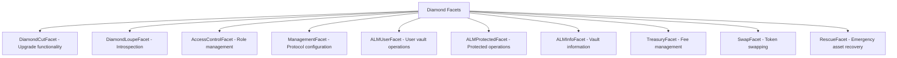
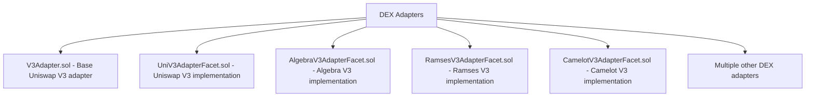
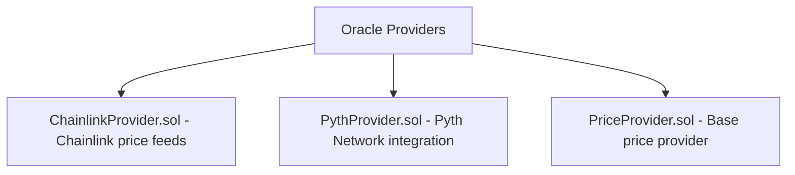

# BTR Protocol Upgradeability Architecture

This document provides a comprehensive analysis of the BTR protocol's upgradeability mechanisms, including both the EIP-2535 Diamond Standard implementation for core functionality and the adapter reference system for peripheral integrations.

## 1. Diamond Pattern Implementation (EIP-2535)

### 1.1 Core Architecture

The BTR protocol implements a **hybrid upgradeability pattern** consisting of:

1. **Diamond Proxy** (`BTRDiamond.sol`) - Main entry point implementing EIP-2535
2. **Adapter Reference System** - Indirect upgradeability for peripherals
3. **Centralized Storage** - Diamond storage pattern with namespaced storage

```solidity
// BTRDiamond.sol - Main diamond proxy
contract BTRDiamond is IDiamond {
  using D for address;
  
  constructor(address _owner, address _treasury, address _cutFacet) payable {
    // Initialize with DiamondCutFacet only
    AC.initialize(S.acc(), _owner, _treasury);
    T.setCollector(_treasury);
    
    // Add diamond cut functionality
    D.diamondCut(S.diam(), cut, address(0), "");
  }
  
  // Delegate all calls to appropriate facets
  fallback() external payable {
    Diamond storage diamond = S.diamond();
    address facet = diamond.selectorToFacetAndPosition[msg.sig].facetAddress;
    if (facet == address(0)) revert Errors.NotFound(ErrorType.FUNCTION);
    
    assembly {
      calldatacopy(0, 0, calldatasize())
      let result := delegatecall(gas(), facet, 0, calldatasize(), 0, 0)
      returndatacopy(0, 0, returndatasize())
      switch result
      case 0 { revert(0, returndatasize()) }
      default { return(0, returndatasize()) }
    }
  }
}
```

### 1.2 Diamond Storage Management

**Namespaced Storage Pattern:**
```solidity
// BTRStorage.sol - Centralized storage accessors
library BTRStorage {
  bytes32 constant DIAMOND_NS = keccak256("btr.diamond");
  bytes32 constant CORE_NS = keccak256("btr.core");
  bytes32 constant RESCUE_NS = keccak256("btr.rescue");
  
  function diam() internal pure returns (Diamond storage _ds) {
    bytes32 position = DIAMOND_NS;
    assembly { _ds.slot := position }
  }
  
  function core() internal pure returns (CoreStorage storage _cs) {
    bytes32 position = CORE_NS;
    assembly { _cs.slot := position }
  }
}
```

**Storage Structure:**
```solidity
// BTRTypes.sol - Core storage definitions
struct CoreStorage {
  uint8 version;                    // Protocol version
  AccessControl accessControl;      // Role management
  Restrictions restrictions;        // Protocol restrictions
  RiskModel riskModel;              // Risk parameters
  Treasury treasury;                // Fee management
  Registry registry;                // Pools, vaults, adapters
  Oracles oracles;                  // Price feed management
  bytes32[64] __gap;                // Future expansion
}

struct Registry {
  mapping(bytes32 => PoolInfo) poolInfo;    // Pool configurations
  mapping(address => EnumerableSet.Bytes32Set) dexAdapterPools; // Adapter→Pools mapping
  mapping(uint32 => ALMVault) vaults;       // Vault storage
  mapping(bytes32 => Range) ranges;         // Position storage
  bytes32[16] __gap;
}
```

### 1.3 Diamond Cut Mechanism

**Upgrade Process:**
```solidity
// DiamondCutFacet.sol - Upgrade functionality
contract DiamondCutFacet is IDiamondCut, PermissionedFacet, NonReentrantFacet {
  function diamondCut(
    FacetCut[] calldata _diamondCut,
    address _init,
    bytes calldata _calldata
  ) external override onlyAdmin nonReentrant {
    D.diamondCut(S.diam(), _diamondCut, _init, _calldata);
  }
}
```

**Facet Management Operations:**
- **Add**: New functions to new or existing facets
- **Replace**: Replace function implementations
- **Remove**: Remove functions (and facets if last function)

**Upgrade Authorization:**
- **Only Admin Role** can execute diamond cuts
- **Immediate Effect** - No timelock on upgrades
- **Reentrancy Protection** via `nonReentrant` modifier
- **Initialization Support** via optional `_init` contract

### 1.4 Facet Architecture

**Current Facets:**


## 2. Adapter Reference System

### 2.1 Indirect Upgradeability Pattern

The BTR protocol implements **indirect upgradeability** for external integrations through adapter references stored in the registry:

```solidity
struct PoolInfo {
  bytes32 id;
  address adapter;      // DEX adapter contract address
  address token0;
  address token1;
  bool inverted;
  uint8 decimals;
  uint256 weiPerUnit;
  uint24 tickSize;
  uint32 fee;
  uint16 cScore;
  bytes32[4] __gap;
}
```

### 2.2 DEX Adapter Integration

**Adapter Architecture:**
```solidity
// DEXAdapter.sol - Base adapter contract
abstract contract DEXAdapter is IDEXAdapter, Permissioned {
  constructor(address _diamond) Permissioned(_diamond) {}
  
  // All operations require diamond authorization
  modifier onlyDiamond() {
    require(msg.sender == diamond, "Only diamond");
    _;
  }
  
  // Virtual functions implemented by specific DEX adapters
  function _poolTokens(bytes32 _pid) internal view virtual returns (IERC20, IERC20);
  function _poolState(bytes32 _pid) internal view virtual returns (uint160, int24);
  function _mintRange(Range calldata _range, bytes calldata _data) internal virtual;
  function _burnRange(Range calldata _range, bytes calldata _data) internal virtual;
}
```

**Specific Implementations:**


### 2.3 Oracle Adapter Integration

**Oracle Architecture:**
```solidity
// OracleAdapter.sol - Base oracle adapter
abstract contract OracleAdapter is Permissioned {
  mapping(bytes32 => uint256) internal ttlByFeed;
  address public alt; // Fallback oracle
  
  constructor(address _diamond) Permissioned(_diamond) {}
  
  // Diamond-controlled configuration
  function setFeed(bytes32 _feed, bytes32 _providerId, uint256 _ttl) external onlyDiamond;
  function update(bytes calldata _params) external onlyDiamond;
  function setAlt(address _alt) external onlyDiamond;
}
```

**Specific Implementations:**


### 2.4 Adapter Upgradeability Mechanisms

**1. Pool Adapter Updates:**
```solidity
// LibALMProtected.sol - Adapter management
function setDexAdapter(address _oldAdapter, address _newAdapter, Registry storage _reg) internal {
  if (_newAdapter == address(0)) revert Errors.ZeroAddress();
  if (_oldAdapter == _newAdapter) revert Errors.AlreadyInitialized();

  EnumerableSet.Bytes32Set storage pools = _reg.dexAdapterPools[_oldAdapter];
  uint256 count = pools.length();
  
  // Update all pools using the old adapter
  unchecked {
    for (uint256 i = 0; i < count; i++) {
      _reg.poolInfo[pools.at(i)].adapter = _newAdapter;
    }
  }
  
  // Transfer pool mappings
  _reg.dexAdapterPools[_newAdapter] = pools;
  delete _reg.dexAdapterPools[_oldAdapter];
  
  emit Events.DEXAdapterUpdated(_oldAdapter, _newAdapter, count);
}
```

**2. Oracle Provider Updates:**
```solidity
// LibOracle.sol - Oracle provider management
function setProvider(Oracles storage _os, address _provider, address _replacing, bytes calldata _params) internal {
  if (_provider == address(0)) revert Errors.ZeroAddress();
  if (_replacing == _provider) revert Errors.AlreadyInitialized();

  _validateProvider(_provider);

  if (_replacing != address(0)) {
    EnumerableSet.Bytes32Set storage feeds = _os.providerFeeds[_replacing];
    uint256 count = feeds.length();

    // Update each feed to use new provider
    for (uint256 i = 0; i < count; i++) {
      bytes32 feedId = feeds.at(i);
      Feed storage feed = _os.feeds[feedId];
      feed.provider = _provider;
      IOracleAdapter(_replacing).removeFeed(feedId);
      IOracleAdapter(_provider).setFeed(feedId, feed.providerId, feed.ttl);
    }

    if (_params.length > 0) {
      IOracleAdapter(_provider).update(_params);
    }

    _os.providerFeeds[_provider] = feeds;
    delete _os.providerFeeds[_replacing];
  }
  
  emit Events.DataProviderUpdated(_provider, _replacing, count);
}
```

## 3. Trusted Forwarder Security Model

### 3.1 Security Architecture

The protocol implements a **trusted forwarder pattern** where the Diamond validates permissions and forwards calls to external adapters:

```
User → Diamond (validates permissions) → Adapter (trusts diamond)
```

**Permission Flow:**
```solidity
// ALMProtectedFacet.sol - Protected operations
function rebalance(
  uint32 _vid,
  RebalanceParams calldata _rebalanceData
) external onlyKeeper whenVaultNotPaused(_vid) nonReentrant {
  // Diamond validates keeper permission
  _vid.rebalance(_rebalanceData);  // Forwards to implementation
}

// LibALMBase.sol - Implementation with adapter calls
function mintRange(ALMVault storage _vault, Registry storage _reg, RangeParams memory _rp, bool _push) internal {
  PoolInfo memory pool = poolInfo(_rp.poolId, _reg);
  
  // Diamond delegates to adapter
  bytes memory data = pool.adapter.delegate(IDEX.mintRange.selector, abi.encode(rid));
  (, spent0, spent1) = abi.decode(data, (uint128, uint256, uint256));
}

// DEXAdapter.sol - Adapter trusts diamond
function mintRange(Range calldata _range, bytes calldata _callbackData) 
  external onlyDiamond returns (...) {
  // Adapter trusts diamond performed proper authorization
  return _mintRange(_range, _callbackData);
}
```

### 3.2 Security Boundaries

**Critical Trust Boundaries:**
1. **Diamond ↔ User**: Diamond validates all user permissions
2. **Diamond ↔ Adapter**: Adapters trust diamond's authorization
3. **Adapter ↔ External Protocol**: Adapters handle external integrations

**Security Properties:**
- **Authentication**: Only diamond can call adapter functions
- **Authorization**: Diamond validates role-based permissions
- **Parameter Validation**: Diamond validates all parameters before forwarding
- **Callback Control**: Diamond controls all callback data

## 4. Upgrade Procedures

### 4.1 Diamond Facet Upgrades

**Standard Upgrade Process:**
1. **Deploy New Facet** - Deploy updated facet contract
2. **Prepare Cut** - Create FacetCut array with new implementations
3. **Execute Cut** - Call `diamondCut()` with admin privileges
4. **Verify Upgrade** - Use DiamondLoupe to verify changes

**Example Upgrade:**
```solidity
// Deploy new facet
ALMUserFacet newFacet = new ALMUserFacet();

// Prepare cut to replace existing functions
FacetCut[] memory cuts = new FacetCut[](1);
cuts[0] = FacetCut({
  facetAddress: address(newFacet),
  action: FacetCutAction.Replace,
  functionSelectors: getALMUserFacetSelectors()
});

// Execute upgrade (admin only)
IDiamondCut(diamond).diamondCut(cuts, address(0), "");
```

### 4.2 Adapter Upgrades

**DEX Adapter Upgrade:**
```solidity
// Deploy new adapter
UniV3Adapter newAdapter = new UniV3Adapter(diamond);

// Update all pools using old adapter
ALMProtectedFacet(diamond).setDexAdapter(oldAdapter, address(newAdapter));
```

**Oracle Provider Upgrade:**
```solidity
// Deploy new provider
ChainlinkProvider newProvider = new ChainlinkProvider(diamond);

// Update oracle configuration
OracleFacet(diamond).setProvider(address(newProvider), oldProvider, params);
```

### 4.3 Emergency Upgrades

**Immediate Response Capabilities:**
- **No Timelock** on diamond cuts for rapid response
- **Admin Multisig** required for all upgrades
- **Circuit Breakers** available for emergency stops
- **Facet Isolation** limits blast radius of faulty upgrades

## 5. Upgrade Risks & Mitigations

### 5.1 Diamond Upgrade Risks

**Storage Corruption:**
- **Risk**: Incompatible storage layouts between facet versions
- **Mitigation**: Strict storage gap management and upgrade testing

**Function Collision:**
- **Risk**: Function selector conflicts between facets
- **Mitigation**: Comprehensive selector checking in deployment scripts

**Access Control Bypass:**
- **Risk**: New facets without proper permission checks
- **Mitigation**: Standardized permission patterns and audit requirements

### 5.2 Adapter Upgrade Risks

**Trusted Forwarder Compromise:**
- **Risk**: Malicious adapter could exploit diamond's trust
- **Mitigation**: Adapter validation before registration, permission isolation

**State Inconsistency:**
- **Risk**: Adapter upgrades could create inconsistent state
- **Mitigation**: Graceful migration procedures, state validation

**Integration Failures:**
- **Risk**: New adapters incompatible with existing pools
- **Mitigation**: Comprehensive integration testing, rollback procedures

### 5.3 Security Recommendations

**Pre-Upgrade Security:**
1. **Formal Verification** of critical upgrade paths
2. **Comprehensive Testing** on testnets with realistic data
3. **Third-Party Audits** for major upgrades
4. **Community Review** period for non-emergency upgrades

**Post-Upgrade Monitoring:**
1. **Real-time Monitoring** of all upgraded components
2. **Automated Alerts** for anomalous behavior
3. **Emergency Response Plan** for upgrade failures
4. **Rollback Procedures** for critical issues

## 6. Future Upgradeability Considerations

### 6.1 Planned Enhancements

**Storage Optimization:**
- Migration to more efficient storage patterns
- Compression of frequently accessed data structures

**Modular Architecture:**
- Further decomposition of facets for granular upgrades
- Plugin system for new feature integration

**Cross-Chain Upgrades:**
- Coordinated upgrades across multiple deployments
- State synchronization mechanisms

### 6.2 Long-term Architecture Evolution

**EIP-2535 Extensions:**
- Integration with future diamond standard updates
- Enhanced introspection capabilities

**Adapter Ecosystem:**
- Standardized adapter development framework
- Community-contributed adapter marketplace

**Governance Integration:**
- On-chain governance for upgrade decisions
- Timelock mechanisms for community oversight

---

This upgradeability architecture provides the BTR protocol with maximum flexibility while maintaining security through careful permission management and isolated upgrade paths. The hybrid approach allows for both immediate upgrades when necessary and careful validation of external integrations.
