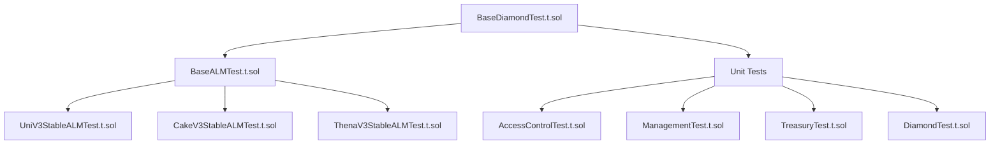

# BTR Protocol Testing Strategy

## Overview

Comprehensive testing strategy for BTR Protocol's Automated Liquidity Management (ALM) system, covering unit tests, integration tests, and end-to-end scenarios across multiple DEX adapters.

## Test Architecture

### Test Hierarchy



### Base Test Components

1. **BaseDiamondTest.t.sol**: Diamond deployment and facet initialization
2. **BaseALMTest.t.sol**: ALM environment setup with virtual methods:
   - `weights()`: Position weight distribution
   - `ranges()`: Tick boundaries for positions
   - `getToken0()`, `getToken1()`: Test token configuration
   - `pools()`: DEX pool addresses

**Reference**: [`evm/test/`](../evm/test/)

## Test Environment

### Network Configuration

- **Primary**: BNB Chain forks (HTTPS_RPC_56)
- **Secondary**: Ethereum mainnet forks for Uniswap V3 testing
- **Local**: Anvil for isolated testing scenarios

### Build Integration

```bash
# Complete test build
make test

# Individual test categories
make test-unit        # Unit tests only
make test-integration # Integration tests only
make test-alm         # ALM-specific tests
```

**Reference**: [`Makefile`](../Makefile)

## Test Coverage Requirements

### Core Functionality Tests

#### 1. Diamond Pattern Testing
- Facet deployment and registration
- Diamond cuts and upgrades
- Function selector routing
- Access control integration

#### 2. ALM Lifecycle Testing
- Vault creation and initialization
- Range position management
- Rebalancing operations
- Fee collection and accounting

#### 3. User Flow Testing
- **Deposit Variants**: Standard, safe, exact amounts, single-sided
- **Withdrawal Variants**: Standard, safe, exact amounts, single-sided
- **Preview Functions**: Accurate estimates for all operations
- **Safety Mechanisms**: Proper reversion when constraints not met

#### 4. DEX Adapter Testing
- Pool registration and validation
- Liquidity minting and burning
- Swap execution and slippage handling
- Fee calculation and collection

### Security Testing

#### Access Control Validation
- `onlyAdmin`: Protocol governance functions
- `onlyManager`: Vault configuration operations
- `onlyKeeper`: Rebalancing and automation
- `onlyTreasury`: Fee collection functions

#### Safety Mechanism Testing
- Reentrancy protection (`nonReentrant`)
- Pause functionality (`whenVaultNotPaused`)
- Input validation and bounds checking
- Emergency rescue operations

**Reference**: [`docs/access-control/roles.md`](./access-control/roles.md)

## Test Implementation Strategy

### DEX-Specific Test Files

Each DEX adapter requires comprehensive testing:

```solidity
contract UniV3StableALMTest is BaseALMTest {
    // Override virtual methods
    function pools() internal override returns (bytes32[] memory) { ... }
    function ranges() internal override returns (Range[] memory) { ... }
    function weights() internal override returns (uint256[] memory) { ... }
    
    // DEX-specific test implementations
    function test_UniV3_Rebalancing() external { ... }
    function test_UniV3_UserFlows() external { ... }
}
```

### Test Scenarios

#### 1. Rebalancing Tests
- **Equal Rebalance**: Same ranges, no swaps required
- **Full Rebalance**: Different ranges requiring token swaps
- **Partial Rebalance**: Selective range updates
- **Emergency Rebalance**: Liquidation scenarios

#### 2. User Flow Tests
- **Standard Operations**: Normal deposit/withdrawal flows
- **Edge Cases**: Minimum/maximum amounts, slippage limits
- **Error Conditions**: Insufficient balance, paused vaults
- **Fee Scenarios**: Various fee configurations and calculations

#### 3. Integration Tests
- **Multi-DEX Operations**: Cross-protocol interactions
- **Oracle Integration**: Price feed validation
- **Keeper Operations**: Automated rebalancing triggers
- **Treasury Operations**: Fee collection and distribution

## Test Data and Scenarios

### Test Token Configuration

- **Stable Pairs**: USDC/USDT for low-volatility testing
- **Volatile Pairs**: ETH/USDC for high-volatility scenarios
- **Exotic Pairs**: Custom tokens for edge case testing

### Price Range Testing

- **In-Range**: Current price within active ranges
- **Out-of-Range**: Price movements outside ranges
- **Range Transitions**: Price crossing range boundaries
- **Extreme Movements**: Large price swings and rebalancing

## Test Validation

### Accuracy Requirements

- **Preview Functions**: ±0.1% accuracy vs actual operations
- **Fee Calculations**: Exact match with expected fees
- **Balance Accounting**: Zero tolerance for accounting errors
- **Gas Usage**: Within 10% of expected gas consumption

### Performance Benchmarks

- **Deployment**: < 15M gas for complete system
- **Vault Creation**: < 500K gas per vault
- **Rebalancing**: < 2M gas for 3-range rebalance
- **User Operations**: < 200K gas for standard deposit/withdrawal

## Known Issues and Considerations

### Current Limitations

1. **Dust Handling**: Excess tokens after rebalancing not properly tracked per vault
2. **Token Sorting**: Requires validation across all DEX adapters for consistency
3. **Fee Accounting**: Per-vault fee tracking needs verification
4. **Preview Accuracy**: Some edge cases may have estimation errors

### Testing Priorities

1. **High Priority**: Access control, user fund safety, fee accuracy
2. **Medium Priority**: Gas optimization, preview function accuracy
3. **Low Priority**: Edge case handling, performance optimization

**Reference**: [`docs/todo.md`](./todo.md) for testing roadmap

## Continuous Integration

### Automated Testing

- **Pre-commit**: Unit tests and linting
- **Pull Request**: Full integration test suite
- **Release**: Comprehensive test suite plus gas benchmarks
- **Deploy**: Mainnet fork testing before actual deployment

### Test Reporting

- **Coverage**: Minimum 90% line coverage for core contracts
- **Gas Reports**: Automated gas usage tracking
- **Security**: Static analysis and vulnerability scanning
- **Performance**: Benchmark comparison across versions

---

**Test Execution**:
- **Local Development**: [`scripts/test.sh`](../scripts/test.sh)
- **CI/CD Pipeline**: [`.github/workflows/`](../.github/workflows/)
- **Gas Analysis**: [`scripts/gas-report.sh`](../scripts/gas-report.sh)
