# Treasury Protocol Flows

This document outlines the treasury management and fee collection operations within the BTR protocol, focusing on fee configuration, collection mechanisms, and treasury administration performed by admins, managers, and treasury roles.

## Overview

The BTR treasury system manages protocol revenue streams through:

- **Fee Configuration**: Setting default and vault-specific fee structures
- **Fee Collection**: Automated and manual collection of protocol fees
- **Treasury Management**: Collector address configuration and fund distribution
- **Custom Fee Handling**: User-specific fee overrides and validation

## Treasury Architecture

### Core Components

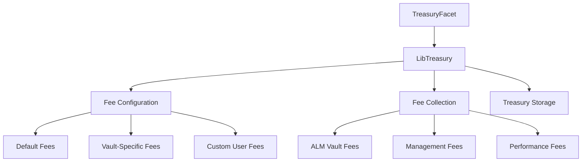

### Fee Structure

```solidity
struct Fees {
    uint16 entryFeeBp;      // Entry fee in basis points
    uint16 exitFeeBp;       // Exit fee in basis points
    uint16 performanceFeeBp; // Performance fee in basis points
    uint16 managementFeeBp;  // Management fee in basis points
}
```

## Treasury Initialization

### 1. Treasury Setup

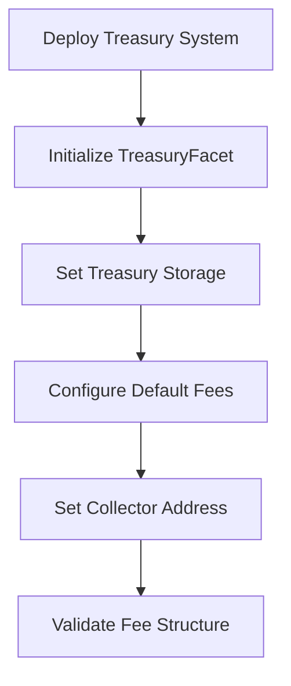

**Function**: `TreasuryFacet.initializeTreasury()`

**Initial Configuration**:
- Initialize treasury storage
- Set default fee structure
- Configure collector address
- Validate fee parameters

## Collector Management

### 1. Collector Configuration

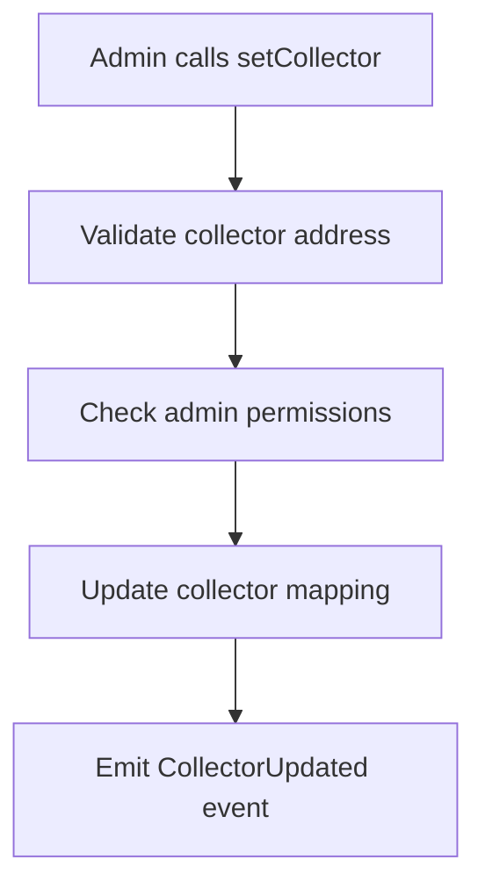

**Function**: `TreasuryFacet.setCollector()`

**Access Control**: Only admins can set the collector address

**Validation**:
- Non-zero address required
- Admin role verification
- Event emission for transparency

### 2. Collector Query

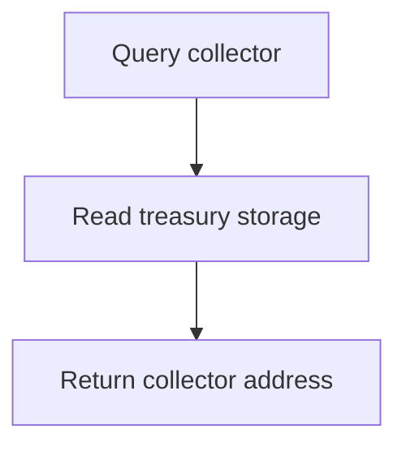

**Function**: `TreasuryFacet.collector()`

**Returns**: Current treasury collector address

## Fee Configuration

### 1. Default Fee Management

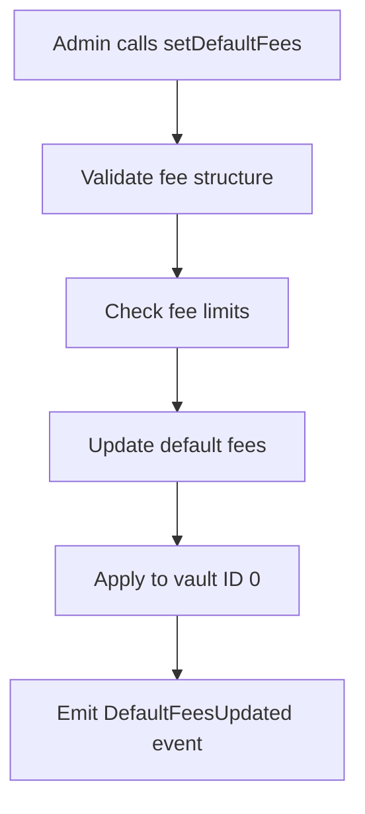

**Function**: `TreasuryFacet.setDefaultFees()`

**Fee Validation**:
- Entry fee ≤ maximum allowed
- Exit fee ≤ maximum allowed  
- Performance fee ≤ maximum allowed
- Management fee ≤ maximum allowed

### 2. Vault-Specific Fee Configuration

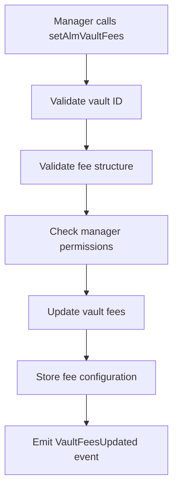

**Function**: `TreasuryFacet.setAlmVaultFees()`

**Parameters**:
- `vid`: Vault ID
- `fees`: Fee structure for the vault

**Access Control**: Only managers can set vault-specific fees

### 3. Custom User Fee Configuration

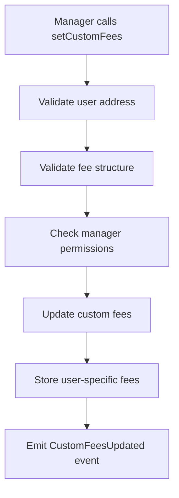

**Function**: `ManagementFacet.setCustomFees()` (delegated to LibTreasury)

**Parameters**:
- `_user`: User address
- `_fees`: Custom fee structure

**Access Control**: Only managers can set custom fees

## Fee Validation

### 1. Fee Structure Validation

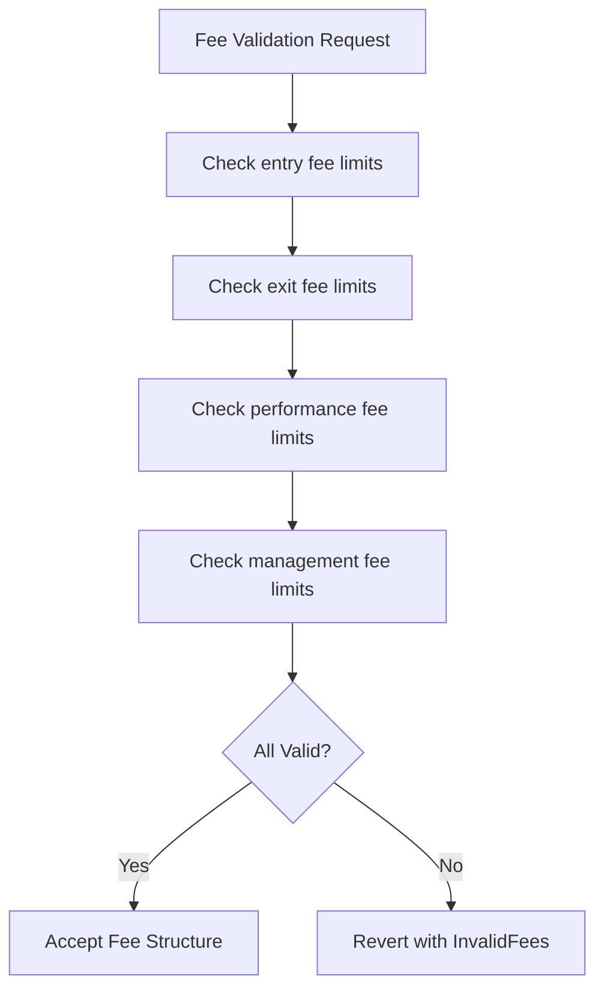

**Function**: `TreasuryFacet.validateFees()`

**Validation Rules**:
- Entry fee: 0 ≤ fee ≤ MAX_ENTRY_FEE_BP
- Exit fee: 0 ≤ fee ≤ MAX_EXIT_FEE_BP
- Performance fee: 0 ≤ fee ≤ MAX_PERFORMANCE_FEE_BP
- Management fee: 0 ≤ fee ≤ MAX_MANAGEMENT_FEE_BP

### 2. Fee Limit Constants

```solidity
uint256 public constant MAX_ENTRY_FEE_BP = 500;      // 5%
uint256 public constant MAX_EXIT_FEE_BP = 500;       // 5%
uint256 public constant MAX_PERFORMANCE_FEE_BP = 2000; // 20%
uint256 public constant MAX_MANAGEMENT_FEE_BP = 200;   // 2%
```

## Fee Collection Operations

### 1. ALM Vault Fee Collection

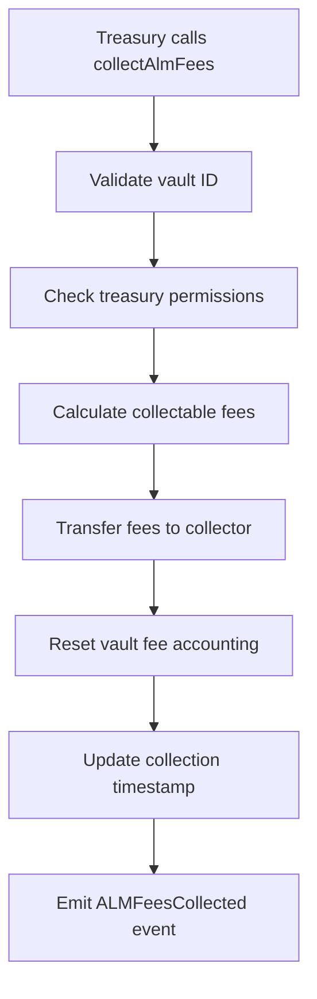

**Function**: `TreasuryFacet.collectAlmFees()`

**Access Control**: Only treasury role can collect fees

**Collection Process**:
1. Validate vault exists and has pending fees
2. Calculate total collectable amount (management + performance)
3. Transfer tokens to treasury collector
4. Reset vault fee accounting
5. Update last collection timestamp

### 2. Fee Calculation Logic

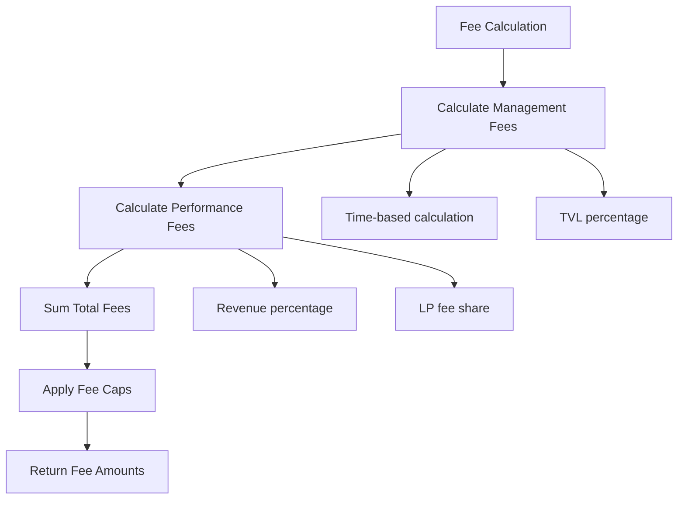

**Management Fee Calculation**:
```solidity
managementFee = (tvl * managementFeeBp * timePeriod) / (BPS * SECONDS_PER_YEAR)
```

**Performance Fee Calculation**:
```solidity
performanceFee = (lpFeeRevenue * performanceFeeBp) / BPS
```

## Fee Query Operations

### 1. Default Fee Queries

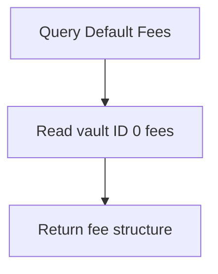

**Function**: `TreasuryFacet.defaultFees()`

**Returns**: Default fee structure applied to new vaults

### 2. Vault-Specific Fee Queries

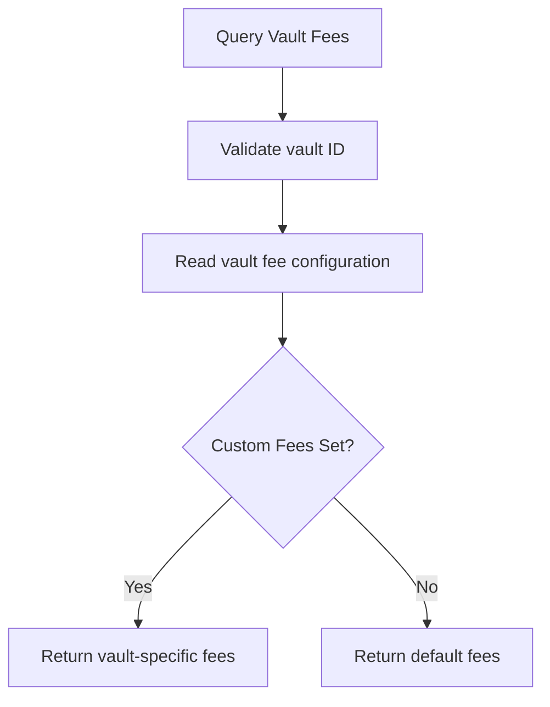

**Function**: `TreasuryFacet.almVaultFees()`

**Parameters**: `vid` - Vault ID

**Returns**: Fee structure for the specified vault

## Fee Accrual Process

### 1. Management Fee Accrual

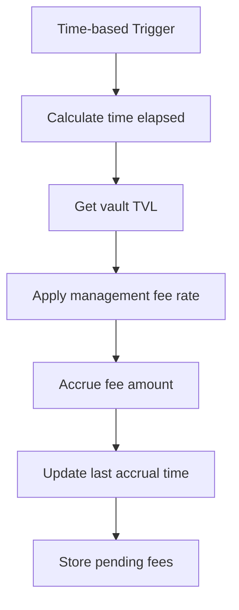

**Accrual Logic**:
- Triggered during vault operations
- Time-proportional calculation
- Based on vault TVL
- Stored as pending collection

### 2. Performance Fee Accrual

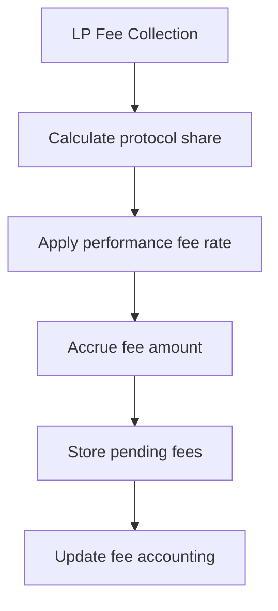

**Accrual Logic**:
- Triggered during rebalancing
- Based on LP fee revenue
- Percentage of generated fees
- Immediate accrual to pending

## Treasury Accounting

### 1. Fee Tracking

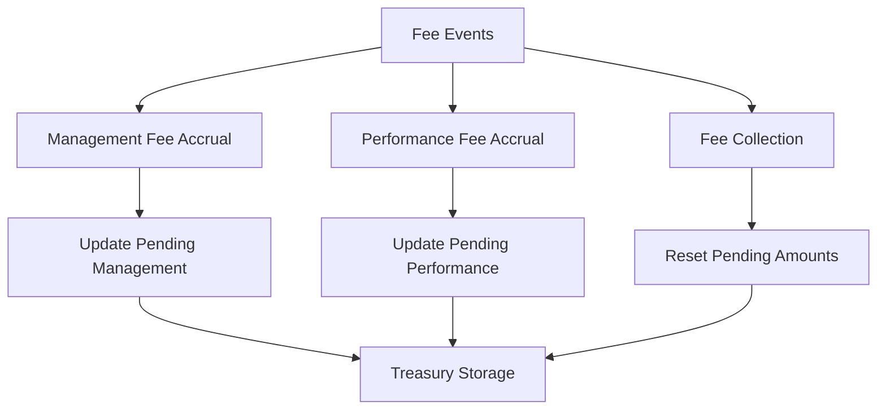

### 2. Collection History

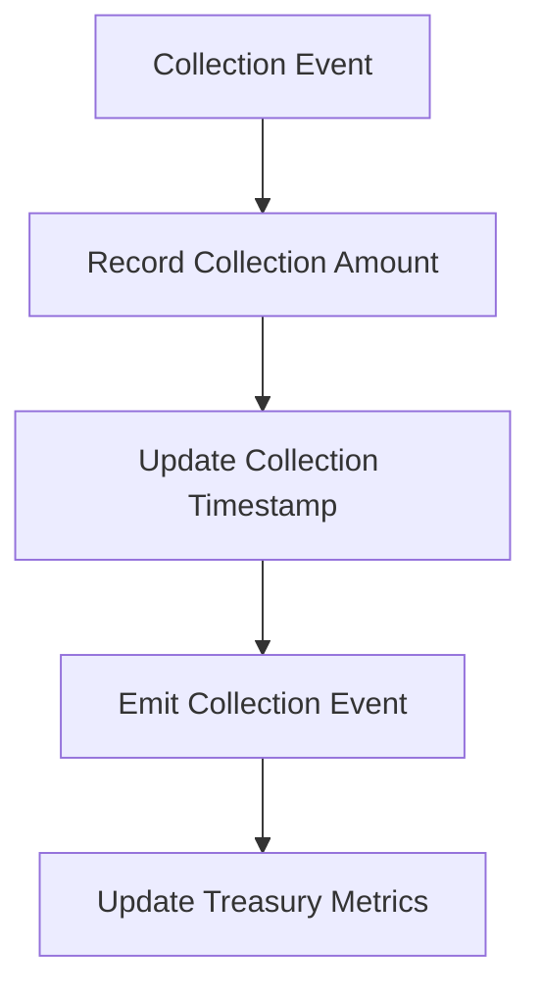

## Revenue Streams

### 1. Entry/Exit Fees

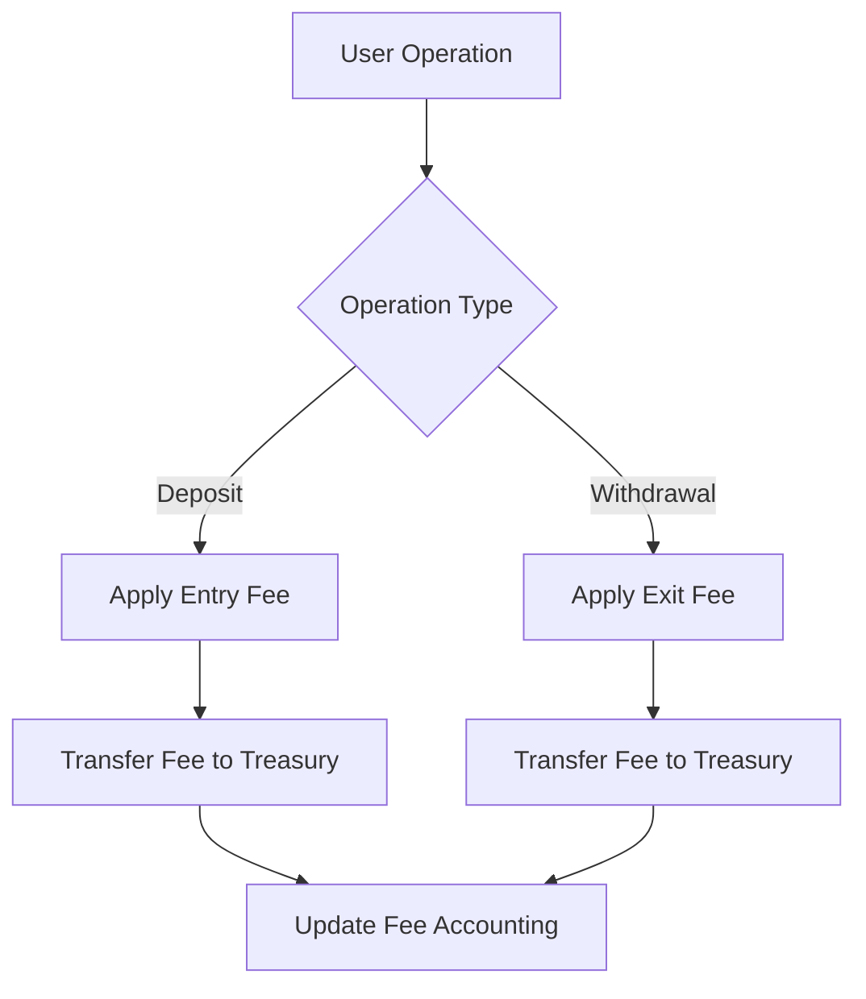

### 2. Management Fees

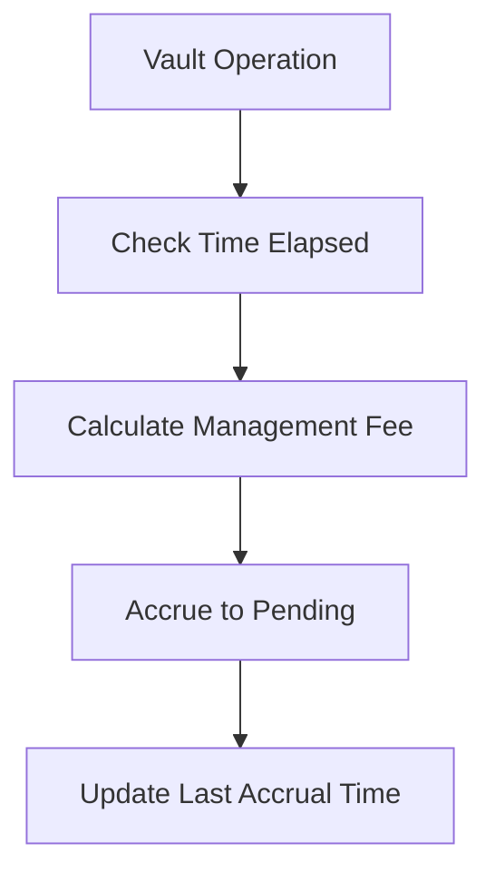

### 3. Performance Fees

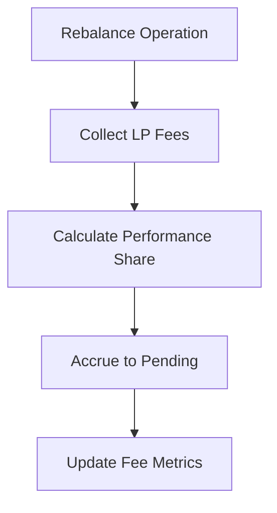

## Access Control Matrix

| Operation | Admin | Manager | Treasury | Keeper | Public |
|-----------|-------|---------|----------|--------|--------|
| Initialize Treasury | ✓ | ✗ | ✗ | ✗ | ✗ |
| Set Collector | ✓ | ✗ | ✗ | ✗ | ✗ |
| Set Default Fees | ✓ | ✗ | ✗ | ✗ | ✗ |
| Set Vault Fees | ✗ | ✓ | ✗ | ✗ | ✗ |
| Set Custom Fees | ✗ | ✓ | ✗ | ✗ | ✗ |
| Collect ALM Fees | ✗ | ✗ | ✓ | ✗ | ✗ |
| Validate Fees | ✗ | ✗ | ✗ | ✗ | ✓ |
| Query Fees | ✗ | ✗ | ✗ | ✗ | ✓ |
| Query Collector | ✗ | ✗ | ✗ | ✗ | ✓ |

## Integration Examples

### 1. Setting Up Default Fees

```solidity
// Configure default fee structure
Fees memory defaultFees = Fees({
    entryFeeBp: 25,      // 0.25%
    exitFeeBp: 25,       // 0.25%
    performanceFeeBp: 1000, // 10%
    managementFeeBp: 100   // 1%
});

treasuryFacet.setDefaultFees(defaultFees);
```

### 2. Vault-Specific Fee Configuration

```solidity
// Set custom fees for high-performance vault
Fees memory vaultFees = Fees({
    entryFeeBp: 50,       // 0.5%
    exitFeeBp: 50,        // 0.5%
    performanceFeeBp: 1500, // 15%
    managementFeeBp: 150    // 1.5%
});

treasuryFacet.setAlmVaultFees(vaultId, vaultFees);
```

### 3. Fee Collection

```solidity
// Collect all pending fees for a vault
treasuryFacet.collectAlmFees(vaultId);
```

## Error Handling

### Common Error Scenarios

1. **Invalid Fee Structure**: Fees exceed maximum limits
2. **Unauthorized Access**: Non-treasury role attempting collection
3. **Invalid Vault**: Vault doesn't exist or has no fees
4. **Zero Address**: Attempting to set zero collector address

### Recovery Procedures

1. **Fee Limit Exceeded**: Adjust fees within valid ranges
2. **Access Denied**: Verify role assignments
3. **Collection Failed**: Check vault state and pending amounts
4. **Configuration Error**: Reset to default configuration

## Monitoring and Metrics

### 1. Fee Performance Tracking

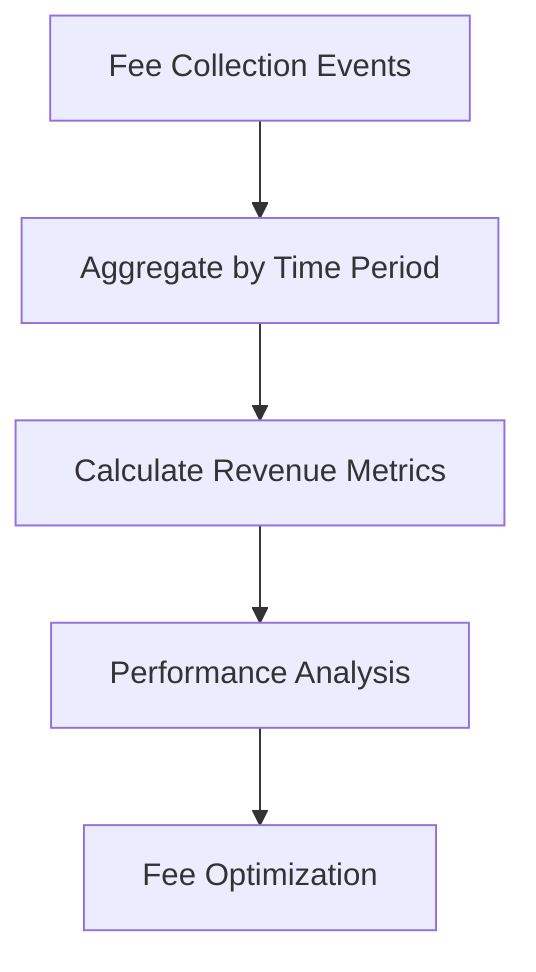

### 2. Treasury Health Monitoring

- **Collection Frequency**: How often fees are collected
- **Revenue Growth**: Trend analysis of fee generation
- **Fee Efficiency**: Performance vs. management fee balance
- **Vault Profitability**: Per-vault revenue analysis

This comprehensive treasury protocol flow documentation ensures proper understanding and implementation of all treasury management operations within the BTR protocol.
